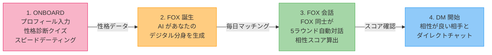

<p align="center">
  
</p>

<h1 align="center">WingFox</h1>

<p align="center">
  <strong>あなたの代わりに、キツネが恋を探す。</strong><br/>
  AIペルソナが相性を見極める、次世代マッチングプラットフォーム
</p>

<p align="center">
  
  
  
  
  
</p>

---

## What is WingFox?

マッチングアプリに疲れていませんか？

WingFox は「自分で相手を選ぶ」のではなく、**AI が生成したあなたの分身 ── "ウィングフォックス"** が代わりに相手と会話し、相性を客観的にスコアリングする全く新しいマッチングサービスです。

### 従来のマッチングアプリとの違い

| | 従来のアプリ | WingFox |
|---|---|---|
| **判断基準** | 写真とプロフィール文 | AI が分析した性格・価値観の相性 |
| **最初の接触** | 自分でメッセージを考える | FOX（AI分身）同士が自動で会話 |
| **相性の根拠** | 直感・見た目 | プロフィールスコア + 会話スコアの2軸評価 |
| **マッチング** | 大量スワイプ | 毎日厳選されたペアを提案 |

---

## How It Works



### 1. オンボーディング
プロフィール入力、性格診断クイズ、スピードデーティング（AIとのお試し会話）を通じて、あなたの人となりを深く理解します。

### 2. ウィングフォックス誕生
あなたの回答を基に、AI がパーソナリティを凝縮した **デジタル分身（FOX）** を生成。8つのセクションで構成された、あなたの代弁者です。

### 3. FOX 会話 & スコアリング
毎日、厳選されたペアのFOX同士が **5ラウンドの自動会話** を実施。プロフィール比較 + 会話分析の **2軸** で客観的な相性スコアを算出します。

### 4. ダイレクトチャット
スコアと FOX 会話の内容を確認したうえで、気になる相手にチャットリクエスト。承認されればリアルタイムDMがスタートします。

---

## Key Features

- **AI ペルソナ生成** ── Mistral AI による高精度な性格モデリング
- **自動 FOX 会話** ── 人間が介在しない客観的な相性判定
- **日次マッチング** ── 毎日新しい出会いをバッチ処理で効率的に提供
- **Interaction DNA** ── 相性をレーダーチャートで直感的に可視化
- **リアルタイムチャット** ── Supabase Realtime による低遅延メッセージング
- **多言語対応** ── 日本語 / English

---

## Tech Stack

```
Frontend          Backend           Infrastructure
─────────────     ─────────────     ─────────────
React 19          Hono              Supabase (PostgreSQL + Auth + Realtime)
Vite              Node.js           Mistral AI API
TanStack Router   Zod               Docker (local dev)
TanStack Query    TypeScript        Turborepo (monorepo)
Tailwind CSS 4                      pnpm
Radix UI
i18next
```

### Monorepo 構成

```
wingfox/
├── apps/
│   ├── web/          # React SPA (ポート 3000)
│   └── api/          # Hono REST API (ポート 3001)
├── supabase/         # マイグレーション & スキーマ
├── scripts/          # バッチ実行 & テストユーザー作成
└── docs/             # 要件ドキュメント
```

---

## Getting Started

### 必要なもの

- [mise](https://mise.jdx.dev/)
- [Docker](https://www.docker.com/) (Supabase ローカル起動用)

### セットアップ

```bash
# 1. ツールインストール (Node.js 22 + pnpm)
mise install

# 2. 依存関係インストール
pnpm install

# 3. Supabase ローカル起動
npx supabase start

# 4. 環境変数を設定
cp apps/api/.env.example apps/api/.env
cp apps/web/.env.example apps/web/.env
# → Supabase の URL / キー、Mistral API キーを記入

# 5. 開発サーバー起動
pnpm dev
```

| サービス | URL |
|---------|-----|
| Web | http://localhost:3000 |
| API | http://localhost:3001 |
| Supabase Studio | http://localhost:54323 |

### 便利なコマンド

```bash
pnpm build          # 全パッケージビルド
pnpm lint           # Biome lint
pnpm format         # Biome format
pnpm check          # 型チェック
```

---

## CI / CD

- **pre-commit hook**: `pnpm format` + `pnpm build` が自動実行
- **GitHub Actions**: PR を `main` / `develop` に向けると format check・build・lint が走ります
- ブランチ保護の設定手順は [.github/REQUIRE_CI_FOR_MERGE.md](.github/REQUIRE_CI_FOR_MERGE.md) を参照

---

## License

Private repository. All rights reserved.
