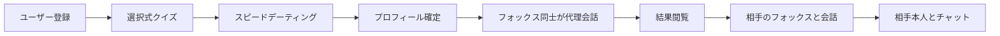
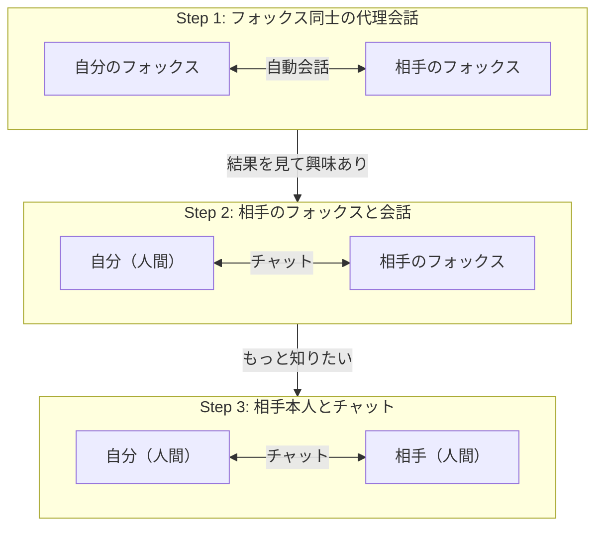

# プロダクト概要

## プロダクト名

**WingFox** - AIマッチング代行

## コンセプト: ウィングフォックス

「Wing Fox」は「ウィングマン（wingman）」にちなんだネーミング。あなたのことをよく理解している同僚・親友のようなキツネ（Fox）の AI が、あなたに代わってマッチング相手を探してくれる。

- **ウィングマン** = 自分のことをよく知っていて、代わりに行動してくれる頼れる存在
- **フォックス** = そのウィングマンが AI のキツネとして具現化されたキャラクター

## ビジョン

「あなた専属のキツネが、最適なパートナーを見つけてくれる」

従来のマッチングアプリでは、ユーザー自身がプロフィールを作成し、相手を探し、メッセージを送り、会話を重ねる必要がある。WingFox では、あなたのことを深く理解した AI キツネ（ウィングフォックス）が代理でコミュニケーションを行い、本質的な相性に基づいたマッチングを実現する。さらに、気になった相手のフォックスと直接会話したり、最終的には相手本人とチャットしたりと、段階的に距離を縮めていける。

## コアバリュー

| バリュー             | 説明                                                                    |
| ---------------- | --------------------------------------------------------------------- |
| 楽しいプロフィール構築      | 選択式クイズとスピードデーティング体験を通じて、自然にプロフィールが完成する                                |
| 行動から読み取る本当の自分    | 自己申告だけでなく、仮想ペルソナとのスピードデーティングでの実際のやり取りから、ユーザーの本当のコミュニケーションスタイルや好みを読み取る |
| ウィングフォックスによる代理会話 | ユーザーの人柄を反映した AI キツネが、他のユーザーの AI キツネと自動的に会話を行い、相性を見極める                 |
| 段階的な距離感の設計       | フォックス同士の代理会話 → 相手のフォックスとの会話 → 相手本人との会話と、段階を踏んで自然に距離を縮められる             |
| 本質的な相性判定         | 表面的なプロフィール情報だけでなく、AI キツネ同士の会話内容から深いレベルでの相性を評価する                       |

## ターゲットユーザー

- **年齢層**: 20〜40 代
- **ペルソナ**:
  - マッチングアプリでのメッセージのやり取りに疲れている人
  - 自己紹介文を書くのが苦手な人
  - 忙しくてマッチングアプリに時間を割けない人
  - 表面的なプロフィールではなく、内面的な相性で相手を見つけたい人
  - いきなり人間と話すのは緊張するが、AI を挟むことで自然に始めたい人
  - ゲーム的な体験を楽しみたい人

## メインフロー

### マッチング後の 3 段階コミュニケーション

マッチング後、ユーザーは段階的に相手との距離を縮めていく。

| Step   | 概要               | 目的                                                      |
| ------ | ---------------- | ------------------------------------------------------- |
| Step 1 | フォックス同士の代理会話（自動） | プロフィールベースの相性を見極める                                       |
| Step 2 | 相手のフォックスと自分が直接会話 | 相手の人柄を AI を通じて体験する。相手のフォックスは相手の性格・話し方を再現しており、疑似的に相手と話せる |
| Step 3 | 相手本人とのリアルチャット    | 実際に人間同士でコミュニケーションを取る                                    |

## ユーザーストーリー

### US-1: ユーザー登録

> ユーザーとして、メールアドレスまたはソーシャルアカウントで簡単に登録できる。

- メール/パスワードでの新規登録
- Google / Apple などのソーシャルログイン
- 利用規約・プライバシーポリシーへの同意

### US-2: 選択式クイズ

> ユーザーとして、楽しい選択式の質問に答えることで、自分の好みや性格の傾向を手軽に伝えられる。

- 登録後、スワイプやタップで簡単に回答できる選択式クイズが始まる
- 性格、趣味、価値観、恋愛観、ライフスタイルに関する質問が出題される
- 1 問あたり 2〜4 択で、直感的に回答できる
- 全 10〜15 問程度で、2〜3 分で完了

### US-3: スピードデーティング

> ユーザーとして、選択結果をもとに生成された仮想ペルソナと短い会話を体験することで、自分のコミュニケーションスタイルをシステムに伝えられる。

- クイズ回答後、選択結果に基づいた仮想ペルソナ（AI キャラクター）が生成される
- 仮想ペルソナと 3〜5 分程度の短い「スピードデーティング」会話を行う
- 複数の仮想ペルソナとスピードデーティングを行う（2〜3 人）
- 会話の内容・スタイル・反応パターンからプロフィールが精緻化される

### US-4: プロフィール確認・編集

> ユーザーとして、選択クイズとスピードデーティングから生成されたプロフィールを確認し、必要に応じて修正できる。

- 選択結果とスピードデーティングの内容から構造化プロフィールが自動生成される
- 各項目（性格タグ、趣味リスト、価値観スコアなど）を確認できる
- 内容に誤りがあれば手動で編集できる
- プロフィールに納得したら確定し、マッチング対象となる

### US-5: ウィングフォックスによるマッチング＆代理会話

> ユーザーとして、自分の AI キツネ（ウィングフォックス）が自動的に相性の良い候補を見つけ、代わりに会話してくれる。

- プロフィール確定後、バックグラウンドでマッチング処理が実行される
- マッチした相手のウィングフォックスと自分のウィングフォックスが自動で会話する
- 会話は複数ラウンド行われ、相性スコアが算出される

### US-6: 結果閲覧

> ユーザーとして、ウィングフォックス同士の会話ログと相性スコアを確認し、気になる相手を見つけられる。

- マッチング結果が相性スコア順に一覧表示される
- 各マッチのウィングフォックス同士の会話ログを閲覧できる
- 会話の内容から、相手がどのような人物かを把握できる

### US-7: 相手のフォックスと会話

> ユーザーとして、マッチ相手のウィングフォックスと直接会話することで、相手の人柄を AI を通じて体験できる。

- マッチング結果から気になる相手を選ぶ
- 相手のウィングフォックスとチャット画面で会話できる
- フォックスは相手の性格・話し方・興味を再現しているため、疑似的に相手と話している感覚を得られる
- 自分のペースで質問したり、話題を振ったりできる
- 「この人ともっと話したい」と思ったら、相手本人とのチャットをリクエストできる

### US-8: 相手本人とチャット

> ユーザーとして、マッチ相手と直接チャットで会話し、実際の関係を築ける。

- 相手のフォックスとの会話後、相手本人とのチャットをリクエストできる
- 双方がチャットリクエストを承認した場合にチャットルームが開設される
- リアルタイムのテキストチャットで人間同士のコミュニケーションが可能
- チャット履歴は保存され、後から閲覧可能

### US-9: プロフィール更新

> ユーザーとして、自分の状況や考えが変わった際にクイズとスピードデーティングをやり直せる。

- プロフィール確定後でも、再度クイズ＆スピードデーティングを受けられる
- 新しい結果でプロフィールを更新できる

## 用語定義

| 用語             | 定義                                                                             |
| -------------- | ------------------------------------------------------------------------------ |
| ウィングフォックス      | ユーザーの人柄・性格を反映した AI キツネ。ユーザーの「親友のような同僚」として、代理で他のユーザーの AI キツネと会話を行う              |
| 選択式クイズ         | 性格・好み・価値観を把握するための多選択式アンケート。オンボーディングの第 1 フェーズ                                   |
| スピードデーティング     | 仮想ペルソナとの短い会話体験。選択結果に基づいた AI キャラクターと会話し、実際のコミュニケーションスタイルを観察する。オンボーディングの第 2 フェーズ |
| 仮想ペルソナ         | スピードデーティング用に生成される AI キャラクター。ユーザーの選択結果に合いそうな異なるタイプの人物像                          |
| プロフィール         | 選択クイズの回答 + スピードデーティングの会話内容から AI が自動生成する構造化されたユーザー情報                            |
| マッチング          | プロフィール情報をもとに相性の良い候補を選定するプロセス                                                   |
| 代理会話           | マッチした 2 人のユーザーのウィングフォックス同士が行う自動会話（Step 1）                                      |
| パートナーフォックスチャット | マッチ相手のウィングフォックスとユーザー自身が直接会話すること（Step 2）                                        |
| ダイレクトチャット      | マッチ相手の人間とユーザー自身がリアルタイムで会話すること（Step 3）                                          |
| 相性スコア          | プロフィール比較およびウィングフォックス同士の会話内容から算出される、2 人のユーザー間の相性を示す数値                           |
| チャットリクエスト      | ダイレクトチャットを開始するための双方合意の仕組み                                                      |

