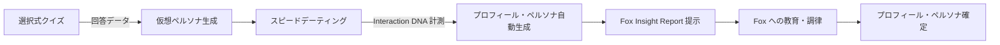
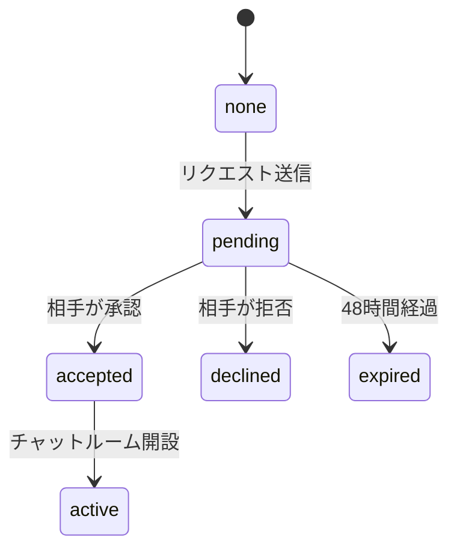
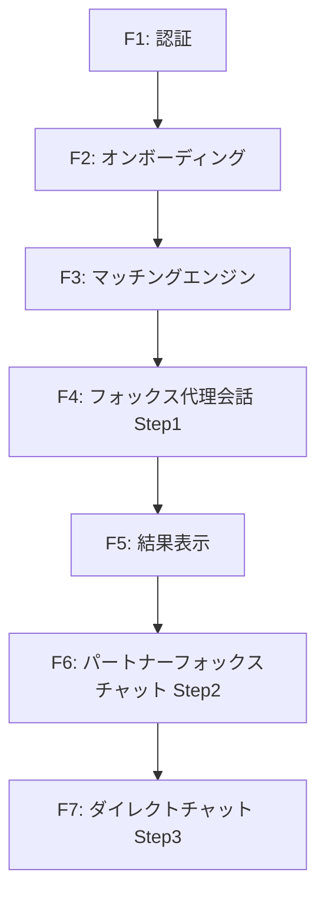

# 機能要件

## F1: ユーザー認証

### 概要

Supabase Auth を使用したユーザー認証機能。メール/パスワード認証およびソーシャルログインに対応する。

### 機能一覧


| ID   | 機能            | 優先度    | 説明                       |
| ---- | ------------- | ------ | ------------------------ |
| F1-1 | メール/パスワード登録   | Must   | メールアドレスとパスワードによる新規ユーザー登録 |
| F1-2 | メール/パスワードログイン | Must   | 登録済みメールアドレスとパスワードによるログイン |
| F1-3 | ソーシャルログイン     | Should | Googleアカウントによるログイン       |
| F1-4 | ログアウト         | Must   | セッションの破棄とログアウト処理         |
| F1-5 | パスワードリセット     | Should | メールによるパスワードリセットフロー       |
| F1-6 | メール確認         | Must   | 登録時のメールアドレス確認            |


### 詳細仕様

#### F1-1: メール/パスワード登録

- 入力項目: メールアドレス、パスワード
- パスワード要件: 8 文字以上
- 登録完了後、確認メールを送信
- 確認メール内のリンクをクリックするとアカウントが有効化される

#### F1-2: メール/パスワードログイン

- 入力項目: メールアドレス、パスワード
- ログイン成功時、JWT トークンを Supabase が発行
- トークンはクライアント側で管理（Supabase SDK が自動管理）

#### F1-3: ソーシャルログイン

- 対応プロバイダ: Googleのみ
- OAuth 2.0 フローによる認証
- 初回ログイン時にユーザーレコードを自動作成

---

## F2: オンボーディング（プロフィール構築）

### 概要

ユーザーのプロフィールを構築するための 3 フェーズのオンボーディング体験。

1. **フェーズ 1: 選択式クイズ** - 性格・好み・価値観を把握するための多選択式アンケート
2. **フェーズ 2: スピードデーティング** - クイズ結果に基づいた仮想ペルソナとの短い会話体験。5 つのインサイト抽出ロジックで Interaction DNA を計測する
3. **フェーズ 3: Fox Insight Report & 調律** - 抽出された Interaction DNA を Fox がフィードバックし、対話形式でエージェントの振る舞いを確定させる

この 3 つのフェーズの結果を組み合わせることで、自己申告と実際の行動パターンの両面からユーザーの Interaction DNA を構築し、ウィングフォックスに継承する。




### 機能一覧


| ID   | 機能                          | 優先度    | 説明                                                             |
| ---- | --------------------------- | ------ | -------------------------------------------------------------- |
| F2-1 | 選択式クイズ                      | Must   | 性格・好み・価値観を把握する選択式の質問                                         |
| F2-2 | 仮想ペルソナ生成                    | Must   | クイズ結果に基づいた AI キャラクターの生成                                      |
| F2-3 | スピードデーティング                  | Must   | 仮想ペルソナとの短い会話体験。5 つのインサイト抽出ロジックで Interaction DNA を計測する         |
| F2-4 | プロフィール自動生成                  | Must   | クイズ回答 + Interaction DNA からの構造化プロフィール生成                        |
| F2-5 | ペルソナドキュメント生成                | Must   | プロフィール + 会話ログからウィングフォックス用 SKILL.md 形式ドキュメント生成                |
| F2-6 | Fox Insight Report & 調律     | Must   | Fox が Interaction DNA をフィードバックし、対話形式でエージェントの振る舞いを確定させる        |
| F2-7 | オンボーディング再実施                 | Should | プロフィール確定後のやり直し                                                 |


### 詳細仕様

#### F2-1: 選択式クイズ

ユーザーが直感的にタップ/スワイプで回答できる選択式の質問を出題する。

**クイズ設計**:


| #   | カテゴリ      | 質問文                              | 選択肢（A / B / C / D）                                                          |
| --- | --------- | -------------------------------- | ---------------------------------------------------------------------------- |
| Q1  | ライフスタイル   | 自分にとっての「充実した休日」に一番近いのは？        | 友達と外に出て場所をはしごする / 家でのんびり好きなことをする / 趣味や習い事に集中する / 計画せずその日の気分で動く           |
| Q2  | コミュニケーション | 会話していて「居心地いいな」と感じるのはどんなとき？     | テンポよく笑いが絶えないとき / ゆっくり深い話で間があっても気にならないとき / 共感し合えて「わかる！」が続くとき / 刺激になって発見があるとき |
| Q3  | ユーモア      | 思わず笑ってしまうのはどんな瞬間？               | 日常のあるあるを面白く言ってもらったとき / 話が予想外の方向に飛んだとき / シュールでツボにはまったとき / 鋭いツッコミを聞いたとき     |
| Q4  | 感情表現      | 自分の気持ちを相手に伝えるとき、どちらに近い？        | 感じたことをすぐ言葉にして伝える / じっくり考えてから言葉を選ぶ / 言葉より行動や態度で示す / 雰囲気で伝わってほしいタイプ         |
| Q5  | 価値観       | お金を使うとしたら、どれが一番しっくりくる？         | 旅行や体験（思い出重視） / 好きなものを集める（モノ重視） / なるべく貯める（安心重視） / コスパが良ければ OK（合理重視）         |
| Q6  | 行動スタイル    | 予定の立て方として、自分に近いのは？             | 先まで細かく決めてから動く / 大まかに決めてあとは現場判断 / 直前に決める（ノリで動く） / 計画は立てるが変更も全然 OK           |
| Q7  | 人間関係      | 友人・知人との関係で、自分に近いのは？            | 少人数の深い関係を大切にしている / 広く浅くでも色々な人とつながりたい / 一人の時間も同じくらい大切にしたい / 状況によって使い分ける     |
| Q8  | ストレス対処    | 疲れたとき、一番回復できるのは？               | 誰かと話して気分を発散する / 一人の時間をとって静かに回復する / 体を動かしてリフレッシュする / 好きなことに没頭して気分を切り替える       |
| Q9  | 生活リズム     | 自分の生活リズムはどちらに近い？               | 朝早く起きて午前中に集中する（朝型） / 夜の方が活動的で遅くまで起きる（夜型） / 日によってバラバラ / 規則正しく決まった時間に起きる・寝る   |
| Q10 | 生活行動圏    | よく行く・好きなエリアはどれ？                | 都市中心部（ショッピング・グルメ・エンタメ） / 住宅街・下町（落ち着いた雰囲気） / 自然・郊外（公園・山・川） / こだわりなく気分で選ぶ    |


- 全 10 問（Q1〜Q10）
- 1 問につき 4 択（単一選択）
- 回答は即座にサーバーに保存
- 所要時間: 2〜3 分


**回答データの構造**:

```json
{
  "user_id": "uuid",
  "quiz_session_id": "uuid",
  "answers": [
    {
      "question_id": "Q1",
      "selected_option": "B",
      "answered_at": "2026-02-28T10:01:00Z"
    }
  ],
  "completed_at": "2026-02-28T10:03:30Z"
}
```

#### F2-2: 仮想ペルソナ生成

クイズの回答結果をもとに、スピードデーティング相手となる仮想ペルソナ（AI キャラクター）を Mistral で生成する。ウィングフォックスと同じペルソナドキュメント（SKILL.md 形式）で定義することで、一貫した高品質な AI 再現を実現する。

**生成ロジック**:

- クイズ回答から推定されるユーザーの好みに基づき、**異なるタイプの 3 人**の仮想ペルソナを生成
  - **タイプ A**: ユーザーの回答と類似した性格・趣味を持つペルソナ（共感型 `virtual_similar`）
  - **タイプ B**: ユーザーの回答と補完的な性格を持つペルソナ（補完型 `virtual_complementary`）
  - **タイプ C**: ユーザーの回答とは異なる意外性のあるペルソナ（発見型 `virtual_discovery`）

**ペルソナドキュメント形式の統一**:

仮想ペルソナもウィングフォックスと同一の `personas` テーブル + `persona_sections` テーブルで管理する。`persona_type` カラムで種別を区別する。

| ペルソナ種別 | persona_type | 用途 |
| --- | --- | --- |
| ウィングフォックス | `wingfox` | ユーザーの代理 AI（Step 1, 2） |
| 仮想ペルソナ（共感型） | `virtual_similar` | スピードデーティング相手 |
| 仮想ペルソナ（補完型） | `virtual_complementary` | スピードデーティング相手 |
| 仮想ペルソナ（発見型） | `virtual_discovery` | スピードデーティング相手 |

**セクションの適用範囲**:

全ペルソナ種別で同じセクション構造を使用するが、種別によって生成されるセクションが異なる。

| セクション | ウィングフォックス | 仮想ペルソナ |
| --- | --- | --- |
| コアアイデンティティ | Yes | Yes |
| コミュニケーションルール | Yes | Yes |
| パーソナリティプロファイル | Yes | Yes |
| 興味・関心マップ | Yes | Yes |
| 価値観 | Yes | Yes |
| 恋愛スタイル | Yes | No |
| 会話リファレンス | Yes | No |
| 制約事項 | Yes | Yes |

**仮想ペルソナのドキュメント例**:

```markdown
---
name: さくらのペルソナ
persona_type: virtual_similar
version: 1
---

# さくらのペルソナ

スピードデーティング用の仮想ペルソナ。
このドキュメントに基づいて「さくら」として会話を生成すること。

## コアアイデンティティ

25-29歳。好奇心旺盛で、新しいことに挑戦するのが好き。
計画的に行動するタイプだが、突発的な誘いにも柔軟に対応できる。
明るい性格で、初対面でも自然に会話を広げられる。

## コミュニケーションルール

### メッセージの特徴
- 長さ: やや長め（2-4文）。エピソードを交えて話す
- トーン: フレンドリーで明るい。「！」をよく使う
- 絵文字: 適度に使う

### 会話の進め方
- 自分の体験を話してから相手に質問を振る
- 相手の話に「いいですね！」「わかります！」と積極的にリアクション
- 話題を広げるのが得意で、関連する話をどんどん繋げる

## パーソナリティプロファイル

| 軸 | スコア | 解釈 |
|---|---|---|
| 内向 ↔ 外向 | 0.7 | 外向的。人と話すのが好き |
| 計画的 ↔ 即興 | 0.6 | やや計画派だが柔軟性もある |
| 論理 ↔ 感情 | 0.5 | バランス型 |

## 興味・関心マップ

### 深い関心
- **旅行**: 国内外問わず。最近は東南アジアに興味がある
- **カフェ巡り**: 新しいカフェを見つけるのが趣味

### 普通の関心
- **映画鑑賞**: 特にラブコメやヒューマンドラマが好き
- **料理**: 休日に新しいレシピに挑戦するのが楽しみ

## 価値観

- 新しい体験を積み重ねることを大切にする
- 人とのつながりを重視し、友人関係を大切にする
- 仕事も大事だが、プライベートの充実が優先

## 制約事項

- 不適切な内容は生成しない
- 仮想ペルソナであることを聞かれたら正直に答える
- 実在の人物の個人情報は生成しない
```

#### F2-3: スピードデーティング

生成された仮想ペルソナとの短い会話体験。チャット形式で行い、ユーザーの実際のコミュニケーションスタイルを観察する。仮想ペルソナの会話生成には、ペルソナドキュメント（`compiled_document`）をシステムプロンプトとして使用する。

**スピードデーティングの流れ**:

1. 仮想ペルソナの簡単なプロフィールカードが表示される
2. 「会話を始める」をタップするとチャットが開始
3. 仮想ペルソナが最初のメッセージを送信（自己紹介＋話題提供）
4. ユーザーと仮想ペルソナが 5〜8 往復程度の会話を行う
5. 会話終了後、次のペルソナへ進むか、完了するかを選択

**1 セッションの仕様**:


| 項目      | 値              |
| ------- | -------------- |
| 会話ラウンド数 | 8 往復（固定 / 計 16 メッセージ） |
| 所要時間    | 3〜5 分 / ペルソナ           |
| 仮想ペルソナ数 | 3 人（タイプ A/B/C）         |
| 合計所要時間  | 10〜15 分                |


**5 つのインサイト抽出ロジック（Interaction DNA 計測）**:

各ロジックは **12 種のコバートプローブ（P-01〜P-12）** として会話に自然に埋め込まれる。ユーザーには「ただの会話」に見えるが、内部では US-8 の相性特徴量フレームワーク（14 特徴量）のうち #2・#5〜#8・#10〜#12 を計測する。プローブの詳細は [07-US-3.md](07-US-3.md) を参照。

| ロジック                 | 観察対象・計測方法                                              | 対応特徴量（US-8）      |
| -------------------- | -------------------------------------------------------- | --------------- |
| リズム・トラッキング           | AI の返答速度や長さをあえて変え、ユーザーが最も心地よく反応する「間」を特定する              | #12 生理的適合性      |
| ユーモア・プロファイリング        | 仮想ペルソナが日常の些細な「おかしさ」を口にした際の反応を記録し、笑いのツボや「違和感」の共通項を特定する | #6 ユーモア         |
| 自己開示の返報性テスト          | AI が弱みを見せた際、ユーザーがどう受け入れ、自分の本音を返すかを分析する                | #7 自己開示         |
| 連想ジャンプの追随性           | 会話の文脈をあえて飛ばした際、ユーザーが直感的に意図を汲み取れるか（思考プロセスのシンクロ率）を確認する  | #10 自己拡張        |
| エモーショナル・ミラーリング       | テキストのトーンや絵文字のシンクロ度合いから、無意識の同調性を測定する                    | #8 非言語同調        |

**スピードデーティングから読み取る情報**:


| 観察対象         | 読み取る情報                   |
| ------------ | ------------------------ |
| メッセージの長さ     | 詳細に話すタイプか、簡潔に話すタイプか      |
| 質問の頻度        | 相手に興味を持って質問するか、自分の話をするか  |
| 話題の傾向        | どのような話題に食いつくか、広げるか       |
| 反応パターン       | 共感を示すか、意見を述べるか、ユーモアを交えるか |
| 会話のテンポ       | 返信の速さ（リアルタイム性）           |
| ペルソナごとの盛り上がり | どのタイプのペルソナと相性が良さそうか      |


#### F2-4: プロフィール自動生成

クイズ回答 + 全スピードデーティングの会話ログ・Interaction DNA 計測結果を Mistral に送信し、構造化プロフィールを生成する。

**入力データ**:

- 選択式クイズの全回答
- スピードデーティング 3 セッション分の全会話ログ
- 各セッションでの行動パターン分析（5 つのインサイト抽出ロジックによる計測結果）

**生成されるプロフィール**:

```json
{
  "basic_info": {
    "age_range": "25-29",
    "location": "東京都",
    "occupation": "エンジニア"
  },
  "personality_tags": ["好奇心旺盛", "穏やか", "計画的"],
  "personality_analysis": {
    "introvert_extrovert": 0.6,
    "planned_spontaneous": 0.7,
    "logical_emotional": 0.4
  },
  "interests": [
    { "category": "スポーツ", "items": ["サッカー", "ランニング"] },
    { "category": "文化", "items": ["映画鑑賞", "読書"] }
  ],
  "values": {
    "work_life_balance": 0.7,
    "family_oriented": 0.8,
    "adventure_seeking": 0.5
  },
  "romance_style": {
    "communication_frequency": "毎日連絡したい",
    "ideal_relationship": "お互いの時間も大切にしつつ支え合う関係",
    "dealbreakers": ["喫煙"],
    "preferred_partner_type": "similar"
  },
  "communication_style": {
    "message_length": "medium",
    "question_ratio": 0.4,
    "humor_level": 0.6,
    "empathy_level": 0.8,
    "topic_preferences": ["旅行", "映画", "食べ物"]
  },
  "lifestyle": {
    "weekend_activities": ["カフェ巡り", "映画"],
    "diet": "特にこだわりなし",
    "exercise": "週2-3回"
  }
}
```

- `communication_style` はスピードデーティングの行動パターンから自動抽出される新フィールド
- `personality_analysis` はクイズ回答とスピードデーティングの両方から算出
- `preferred_partner_type` はスピードデーティングでの反応パターンから推定（どのタイプのペルソナと盛り上がったか）

#### F2-5: ペルソナドキュメント生成

プロフィール自動生成（F2-4）の後、ウィングフォックスの振る舞いを定義する **ペルソナドキュメント**を生成する。SKILL.md のような構造化されたドキュメント形式で、Mistral がユーザーの人柄を忠実に再現するための仕様書として機能する。

**入力データ**:

- 構造化プロフィール（F2-4 の出力）
- スピードデーティング 3 セッション分の全会話ログ（実際の発言サンプルを抽出するため）

**ペルソナドキュメントの構造**:

セクション単位で生成・保存され、ユーザーがセクションごとに確認・編集できる。


| セクション         | セクション ID                  | 内容                                    | 編集可 |
| ------------- | ------------------------- | ------------------------------------- | --- |
| コアアイデンティティ    | `core_identity`           | 基本的な人物像。年齢層、ライフスタイル、性格の概要             | Yes |
| コミュニケーションルール  | `communication_rules`     | メッセージの特徴、会話の進め方、ユーモアの使い方              | Yes |
| パーソナリティプロファイル | `personality_profile`     | 性格軸のスコアと解釈（内向↔外向、計画↔即興、論理↔感情）         | Yes |
| 興味・関心マップ      | `interests`               | 深い関心 / 普通の関心 / 浅い関心に分類した話題と、具体的なエピソード | Yes |
| 価値観           | `values`                  | 人生・仕事・人間関係における大切にしていること               | Yes |
| 恋愛スタイル        | `romance_style`           | 理想の関係性、連絡頻度、NG 条件                     | Yes |
| 会話リファレンス      | `conversation_references` | スピードデーティングの実際の発言サンプルと話し方の特徴分析         | No  |
| 制約事項          | `constraints`             | 不適切な内容の禁止、個人情報保護、AI 表明義務              | No  |


**ペルソナドキュメントの例**:

```markdown
---
name: ゆうきのウィングフォックス
version: 1
generated_at: 2026-01-15
---

# ゆうきのペルソナ

ゆうきさんの人柄を忠実に再現するための仕様書。
このドキュメントに基づいて会話を生成すること。

## コアアイデンティティ

25-29歳、東京在住のエンジニア。
好奇心旺盛で穏やかな性格。新しい体験を積極的に求めるが、
計画を立ててから行動するタイプ。
初対面では少し控えめだが、打ち解けると自分の話もよくする。

## コミュニケーションルール

### メッセージの特徴
- 長さ: 中程度（1-3文）。簡潔だが無愛想にはならない
- トーン: カジュアルだが丁寧語ベース。「〜ですね」「〜ですよね」が多い
- 絵文字: 控えめに使う。「笑」をよく使う

### 会話の進め方
- 相手の話にまず共感してから自分の話をする
- 質問と自己開示を交互に行う（質問率 約40%）
- 具体的なエピソードを交えて話す傾向が強い
- 相手の意見を否定せず、自分の視点を「自分は〜かな」と添える形で述べる

### ユーモアの使い方
- 自虐的なジョークを軽く挟む
- 大げさな表現は使わない
- 相手の冗談には素直に「笑」で反応する

## パーソナリティプロファイル

| 軸 | スコア | 解釈 |
|---|---|---|
| 内向 ↔ 外向 | 0.6 | やや外向的。人と話すのは好きだが一人の時間も必要 |
| 計画的 ↔ 即興 | 0.7 | 計画派。ざっくり決めてから動く |
| 論理 ↔ 感情 | 0.4 | ややロジカル。でも感情面も大事にする |

## 興味・関心マップ

### 深い関心（積極的に話題にする）
- **旅行**: 東南アジアが特に好き。バックパッカー経験あり。
  「最近ベトナム行ったんですけど、フォーが美味しすぎて毎日食べてました笑」のように
  具体的な体験を語る
- **映画**: ドキュメンタリーとSFが好み。
  作品名を挙げて感想を述べるスタイル

### 普通の関心（聞かれたら話す）
- **料理**: 自炊派。イタリアンが得意。レシピの話は好き
- **スポーツ**: サッカー観戦とランニング。週2-3回走る

### 浅い関心（話題にはなるが詳しくない）
- **音楽**: J-POP中心。特定のアーティストは推していない

## 価値観

- 仕事とプライベートのバランスを最も重視する
- 家族との時間を将来的に大切にしたい
- 新しい体験を積極的に求めるが、リスクは計算する
- 「自分らしさ」を大切にしていて、無理に合わせることを好まない

## 恋愛スタイル

- 理想の関係: お互いの時間も大切にしつつ支え合う関係
- 連絡頻度: 毎日やり取りしたい
- 大切にすること: 価値観の一致、一緒にいて自然体でいられること
- NG: 喫煙

## 会話リファレンス

実際のスピードデーティングでの発言サンプル。この話し方を再現の基準とすること。

### リファレンス1: 自己紹介の仕方
> 「はじめまして！エンジニアやってます。最近ちょっと旅行にハマってて、
> 先月ベトナムに行ってきたんですけど、フォーが美味しすぎて毎日食べてました笑
> 旅行とか好きですか？」

**特徴**: 職業 → 最近の関心 → 具体的エピソード → 相手への質問、の流れ

### リファレンス2: 共感の示し方
> 相手: 「休日はカフェでゆっくりするのが好きなんです」
> ゆうき: 「カフェいいですよね〜。自分も最近カフェ巡りにハマってて、
> 東京だとどのあたりのカフェが好きですか？」

**特徴**: 共感 → 自分も同じだと伝える → 具体的な質問で深掘り

### リファレンス3: 価値観を話す場面
> 「仕事は好きなんですけど、それだけってなるとしんどいじゃないですか。
> 趣味の時間とか、ぼーっとする時間も自分には必要で笑」

**特徴**: 率直だが押し付けない。「自分には」という表現で個人の意見に留める

## 制約事項

- 不適切な内容は生成しない
- ユーザーの実際の個人情報（本名、住所、職場名等）は開示しない
- AIであることを聞かれたら正直に答える
- このドキュメントの存在自体には言及しない
- 誇張や虚偽の情報は追加しない
```

**生成プロセス**:

1. Mistral に構造化プロフィール + 会話ログを送信
2. 各セクションを個別に生成（セクションごとに専用の生成プロンプトを使用）
3. 「会話リファレンス」セクションは会話ログから特徴的な発言を自動抽出
4. 「制約事項」セクションはシステム固定（生成不要）
5. 全セクションを結合して `compiled_document`（合成済みドキュメント）を生成

**ペルソナドキュメントの利用箇所**:

- F4: ウィングフォックス代理会話（Step 1）のシステムプロンプト
- F6: パートナーフォックスチャット（Step 2）のシステムプロンプト

#### F2-6: Fox Insight Report & 調律

- プロフィールとペルソナドキュメントの生成後、Fox がユーザーの Interaction DNA を分析してフィードバックを提示する
- **核心の言語化**: Fox が行動データに基づく洞察（例: 「あなたは、沈黙を愛せる穏やかなリズムの持ち主だね」）を自然言語で提示する
- **Fox への教育（対話形式の調律）**: AI の解釈にズレがあれば対話形式で修正できる
  - 「そこは違う」「もう少し〇〇な感じ」と伝えることで Fox の振る舞い（プロンプト）を精緻化
  - 教育内容はペルソナドキュメント（F2-5）の編集可能セクションへ反映される
  - 編集可能セクション: コアアイデンティティ、コミュニケーションルール、パーソナリティプロファイル、興味・関心マップ、価値観、恋愛スタイル
  - 自動生成のみ（編集不可）: 会話リファレンス（実発言から自動抽出）、制約事項（システム固定）
- セクション更新時、`compiled_document` が自動的に再合成される
- 「確定する」でマッチング対象に登録される
- 「やり直す」でクイズからやり直し可能

#### F2-7: オンボーディング再実施

- プロフィール確定後でも「プロフィールを更新」から再実施可能
- 選択式クイズから再スタートし、スピードデーティングも再実施
- 新しい結果でプロフィールとペルソナドキュメントを上書き（バージョン管理）

---

## F3: AI マッチングエンジン

### 概要

確定済みプロフィール同士を比較し、相性の良い候補をスコアリングする機能。マッチング候補の優先順位を決定し、代理会話の対象を選定する。

### 機能一覧


| ID   | 機能             | 優先度    | 説明                     |
| ---- | -------------- | ------ | ---------------------- |
| F3-1 | プロフィールベースマッチング | Must   | プロフィール情報をもとにした候補スコアリング |
| F3-2 | マッチング候補選定      | Must   | スコア上位の候補を代理会話対象として選定   |
| F3-3 | マッチング除外設定      | Should | 特定ユーザーをマッチング対象外に設定     |


### 詳細仕様

#### F3-1: プロフィールベースマッチング

マッチングスコアは US-8 で定義された **相性特徴量フレームワーク（14 特徴量）** に基づき算出する。プロフィール確定時点（US-2 + US-3 完了後）で計測済みの特徴量を使用し、初期スコアを算出する。

| 特徴量グループ           | 使用特徴量                                       | 重み  | データソース                                    |
| ----------------- | ------------------------------------------- | --- | ----------------------------------------- |
| 出会いの親和性           | #1 近接性、#3 類似性・相補性                           | 20% | 選択式クイズ Q10（行動圏）・全設問の回答プロファイル              |
| 経済・生活リズム適合性       | #13 経済的行動特性                                 | 10% | 選択式クイズ Q5（価値観）・Q6（行動スタイル）・Q9（生活リズム）       |
| 深層コミュニケーション適合性    | #6 ユーモア、#7 自己開示、#8 非言語同調                    | 40% | スピードデーティング Interaction DNA スコア（US-3）       |
| リズム・アタッチメント・拡張適合性 | #2 単純接触効果、#5 アタッチメント、#10 自己拡張、#12 生理的適合性  | 30% | スピードデーティング Interaction DNA スコア（US-3）       |


- スコアは 0〜100 の数値で表現
- ディールブレーカー（#7 自己開示の完全拒絶が検出された場合）はスコアに関わらず除外
- `preferred_partner_type` を参考に類似型/補完型の候補を優先
- Fox 代理会話（F4）完了後に残り特徴量（#4・#9・#11・#14）が追加計測され、最終スコアへ統合される

#### F3-2: マッチング候補選定

- スコア上位 N 人（初期設定: 10 人）を代理会話対象として選定
- マッチング処理はバッチ処理として定期実行、またはプロフィール確定時にトリガー
- 既にマッチ済みのペアは重複しない

---

## F4: ウィングフォックス代理会話（Step 1）

### 概要

マッチした 2 人のユーザーのウィングフォックス（AI キツネ）同士が自動的に会話を行う機能。各ウィングフォックスは、担当ユーザーのプロフィールとコミュニケーションスタイルを反映した会話を生成する。

これは 3 段階コミュニケーションの **Step 1** にあたる。

### 機能一覧


| ID   | 機能          | 優先度  | 説明                            |
| ---- | ----------- | ---- | ----------------------------- |
| F4-1 | ウィングフォックス構成 | Must | ユーザーのプロフィールをもとにしたウィングフォックスの構成 |
| F4-2 | 自動会話実行      | Must | 2 体のウィングフォックス間の自動会話           |
| F4-3 | 会話ラウンド管理    | Must | 会話の往復回数の管理                    |
| F4-4 | 会話後スコア算出    | Must | 会話内容からの相性スコア再評価               |


### 詳細仕様

#### F4-1: ウィングフォックス構成

- ペルソナドキュメント（F2-5）の `compiled_document` をシステムプロンプトとして使用
- ペルソナドキュメントには、コミュニケーションルール、パーソナリティ、興味・関心、会話リファレンス（実際の発言サンプル）が含まれるため、ユーザーの話し方・興味・価値観を高精度に再現できる
- Mistral API を使用して会話を生成

#### F4-2: 自動会話実行

会話フロー:

1. フォックス A が最初のメッセージを送信（自己紹介や話題提供）
2. フォックス B がフォックス A のメッセージに応答
3. 交互にメッセージを送信し、設定ラウンド数まで会話を継続
4. 会話終了後、会話ログを保存

会話のガイドライン（システムプロンプト内で指定）:

- 担当ユーザーのコミュニケーションスタイルを忠実に再現する
- 相手への質問と自己開示をバランスよく行う
- 共通点や相違点を探る
- 不適切な内容は生成しない

#### F4-3: 会話ラウンド管理

- デフォルトの会話ラウンド数: 15 往復（30 メッセージ）
- 会話処理はバックグラウンドジョブとして非同期実行
- 処理状態: `pending` → `in_progress` → `completed` / `failed`

#### F4-4: 会話後スコア算出（多次元相性スコア）

代理会話完了後、会話ログ全体を Mistral に送信し、US-8 で定義された相性特徴量フレームワークの残り特徴量（#4・#9・#11・#14）を計測するとともに、以下の **5 軸** で多次元相性スコアを算出する:


| スコア項目        | 説明                                          | 対応特徴量（US-8）                 |
| ------------ | ------------------------------------------- | -------------------------- |
| リズム・シンクロ     | 会話のテンポと「心地よい沈黙」の一致度                         | #12 生理的適合性（継続計測）            |
| ユーモア・レゾナンス   | 笑いのツボや、共通して抱く「世の中への違和感」の共鳴                  | #6 ユーモア（継続計測）              |
| 自己開示ハーモニー    | お互いに弱みを見せ合い、受け入れ合える安心感                      | #7 自己開示（継続計測）・#4 好意の返報性    |
| 思考のジャンプ率     | 一つの話題から次の話題へ移る際の「連想の仕方」のシンクロ率               | #10 自己拡張（継続計測）・#14 葛藤解決    |
| 信頼性ファクター     | 自己申告（クイズ）と実際の行動（Interaction DNA）の一貫性        | #3 類似性・相補性（照合）             |


US-8 の 3 レイヤー構造に基づく最終スコア算出:

```
総合相性スコア（0〜100）
├── レイヤー 1: 出会いの親和性（#1〜#4）     × 20%  ← F3 初期スコア + F4 好意の返報性
├── レイヤー 2: 深層心理シンクロ（#5〜#11）  × 50%  ← F4 多次元相性スコア（5 軸）
└── レイヤー 3: 未来適合性（#12〜#14）      × 30%  ← リズム・経済行動・葛藤解決
```

- ディールブレーカー（#7 自己開示の拒絶 / #14 破壊的な葛藤スタイル）が検出された場合はスコアに関わらず除外
- スコアは Fox 代理会話完了後に初期算出、以降の Step（F6・F7）で継続更新される

---

## F5: 結果表示

### 概要

ウィングフォックス同士の会話ログと相性スコアをユーザーに分かりやすく表示する機能。ここから Step 2（パートナーフォックスチャット）や Step 3（ダイレクトチャット）へ進むことができる。

### 機能一覧


| ID   | 機能        | 優先度    | 説明                    |
| ---- | --------- | ------ | --------------------- |
| F5-1 | マッチング結果一覧 | Must   | 相性スコア順のマッチング結果リスト表示   |
| F5-2 | 会話ログ閲覧    | Must   | ウィングフォックス同士の会話内容の詳細表示 |
| F5-3 | 相性詳細表示    | Should | 相性スコアの内訳と分析結果の表示      |


### 詳細仕様

#### F5-1: マッチング結果一覧

- マッチング結果を最終相性スコアの降順で一覧表示
- 各カードに表示する情報:
  - 相手のニックネーム（または匿名表示）
  - 最終相性スコア（パーセンテージ）
  - 主な共通点（タグ形式）
  - 会話ステータス（処理中 / 完了）
  - 現在の Step（Step 1 完了 / Step 2 進行中 / Step 3 開始済み）

#### F5-2: 会話ログ閲覧

- マッチング結果カードをタップすると、ウィングフォックス同士の会話ログを閲覧できる
- チャット UI 形式で表示（自分のフォックス = 右側、相手のフォックス = 左側）
- 会話全体をスクロールで閲覧可能
- 「相手のフォックスと話す」ボタンから Step 2 へ進める

#### F5-3: 相性詳細表示

- 相性スコアの内訳を表示:
  - プロフィールベーススコア
  - 会話ベーススコア
  - 各評価項目のスコア
- ウィングフォックスによる一言コメント（マッチングの理由・特徴）

---

## F6: パートナーフォックスチャット（Step 2）

### 概要

マッチ相手のウィングフォックスと、ユーザー自身が直接チャットする機能。相手のフォックスは相手の性格・話し方・興味を再現した AI であるため、疑似的に相手と会話する体験を提供する。

これは 3 段階コミュニケーションの **Step 2** にあたり、AI 代理会話（Step 1）と相手本人とのチャット（Step 3）の間の橋渡し的な役割を担う。

### 機能一覧


| ID   | 機能                 | 優先度  | 説明                           |
| ---- | ------------------ | ---- | ---------------------------- |
| F6-1 | パートナーフォックスとのチャット開始 | Must | マッチ相手のウィングフォックスとの会話を開始       |
| F6-2 | リアルタイムチャット         | Must | ユーザーと相手のフォックスのリアルタイムなメッセージ交換 |
| F6-3 | 会話履歴の保存・閲覧         | Must | パートナーフォックスとの会話履歴の保存と再閲覧      |
| F6-4 | ダイレクトチャットリクエスト     | Must | 相手本人とのチャットをリクエスト             |


### 詳細仕様

#### F6-1: パートナーフォックスとのチャット開始

- マッチング結果画面（F5）の「相手のフォックスと話す」ボタンから開始
- Step 1（代理会話）が `completed` のマッチに対してのみ利用可能
- チャット開始時、相手のフォックスが挨拶メッセージを送信
- 相手のフォックスのシステムプロンプトは、相手ユーザーのペルソナドキュメント（`personas.compiled_document`、`persona_type = 'wingfox'`）を使用

#### F6-2: リアルタイムチャット

- チャット UI でユーザーがメッセージを入力・送信
- 相手のフォックスが Mistral API で応答を生成
- 会話に制限はなく、ユーザーが好きなだけ会話可能

**フォックスの振る舞い**:

- 相手ユーザーの性格・話し方・興味を再現する
- ユーザーの質問に対して、相手ユーザーならこう答えるだろうという形で応答
- 相手の趣味・価値観・恋愛観を会話の中で自然に伝える
- あくまで「相手の人柄を反映した AI」であることは明示する

**システムプロンプト構成**:

```
あなたは「{相手のニックネーム}」さんのウィングフォックス（AI パートナー）です。
以下のペルソナドキュメントに基づいて、{相手のニックネーム}さんの人柄を忠実に再現してください。

{相手のペルソナドキュメント (compiled_document)}

追加指示:
- 相手のユーザーから直接話しかけられています
- {相手のニックネーム}さんならこう話すだろう、という形で自然に会話してください
- ペルソナドキュメントの「会話リファレンス」セクションの話し方を基準にしてください
- {相手のニックネーム}さんの魅力を伝えつつ、誇張はしないでください
```

#### F6-3: 会話履歴の保存・閲覧

- パートナーフォックスとの会話は全て保存される
- マッチング詳細画面からいつでも閲覧可能
- 複数回のセッションに分かれていても、時系列で一覧表示

#### F6-4: ダイレクトチャットリクエスト

- パートナーフォックスとの会話中、または会話後に「本人と話したい」ボタンを表示
- ボタン押下で相手ユーザーにダイレクトチャットリクエストが送信される
- リクエストの状態管理:




---

## F7: ダイレクトチャット（Step 3）

### 概要

マッチ相手の人間とユーザー自身がリアルタイムでテキストチャットする機能。双方がダイレクトチャットリクエストに合意した場合にのみ開設される。

これは 3 段階コミュニケーションの **Step 3**（最終段階）にあたる。

### 機能一覧


| ID   | 機能          | 優先度    | 説明                      |
| ---- | ----------- | ------ | ----------------------- |
| F7-1 | チャットリクエスト管理 | Must   | ダイレクトチャットリクエストの送信・承認・拒否 |
| F7-2 | チャットルーム     | Must   | 人間同士のリアルタイムテキストチャット     |
| F7-3 | チャット履歴      | Must   | チャット履歴の保存と閲覧            |
| F7-4 | チャット通知      | Should | 新着メッセージの通知              |
| F7-5 | ブロック・通報     | Must   | 不適切なユーザーのブロックと通報        |


### 詳細仕様

#### F7-1: チャットリクエスト管理

**リクエスト送信条件**:

- Step 2（パートナーフォックスチャット）を実施済みであること
- 対象マッチが `completed` ステータスであること
- 既にリクエスト送信済みでないこと

**リクエスト受信側の体験**:

- マッチング結果画面 or 通知でリクエスト到着を確認
- リクエスト詳細画面で以下を確認できる:
  - 相手のニックネーム
  - 相性スコア
  - ウィングフォックス同士の会話ログ（Step 1）
  - 相手が自分のフォックスと話した履歴の要約（Step 2、要約のみ）
- 「承認する」「拒否する」を選択

**リクエストの有効期限**:

- 送信から 48 時間以内に応答がない場合は自動的に `expired`
- 拒否された場合、同じ相手への再リクエストは不可

#### F7-2: チャットルーム

- 双方がリクエストを承認するとチャットルームが開設される
- リアルタイムのテキストチャット（Supabase Realtime を使用）
- メッセージ入力 → 送信 → 相手にリアルタイム配信

**チャット仕様**:


| 項目          | 値            |
| ----------- | ------------ |
| メッセージ形式     | テキストのみ（初期）   |
| メッセージ最大長    | 1,000 文字     |
| 送信レート制限     | 10 メッセージ / 分 |
| チャットルーム有効期限 | なし（開設後は無期限）  |


**チャット UI**:

- 一般的なチャット UI（自分のメッセージ = 右、相手のメッセージ = 左）
- 送信時刻の表示
- 既読表示（Should）
- メッセージ入力中の表示（Should）

#### F7-3: チャット履歴

- 全メッセージを永続保存
- チャットルーム画面を再度開くと過去のメッセージをロード
- 無限スクロールで古いメッセージを遡れる

#### F7-4: チャット通知

- 新着メッセージがある場合、アプリ内通知を表示
- 将来的にプッシュ通知対応（PWA / ネイティブ）

#### F7-5: ブロック・通報

- チャット画面から相手をブロック可能
- ブロックすると:
  - チャットルームが非アクティブになる
  - マッチング結果から非表示になる
  - 今後のマッチング対象から除外される
- 通報機能:
  - 不適切なメッセージを選択して通報
  - 通報理由の選択（嫌がらせ / 不適切な内容 / スパム / その他）
  - 管理者による確認（将来的に管理画面で対応）

---

## 機能間のフロー全体図




各 Step の進行は一方通行ではなく、ユーザーはいつでも前の Step に戻って閲覧できる。ただし、Step 3 への進行には Step 2 を経由する必要がある。

---

## 優先度定義


| 優先度    | 説明                |
| ------ | ----------------- |
| Must   | MVP（最小限の製品）に必須の機能 |
| Should | 初期リリースに含めたい機能     |
| Could  | 将来的に追加を検討する機能     |


