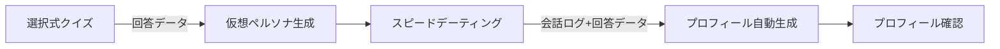

# 機能要件

## F1: ユーザー認証

### 概要

Supabase Auth を使用したユーザー認証機能。メール/パスワード認証およびソーシャルログインに対応する。

### 機能一覧


| ID   | 機能            | 優先度    | 説明                          |
| ---- | ------------- | ------ | --------------------------- |
| F1-1 | メール/パスワード登録   | Must   | メールアドレスとパスワードによる新規ユーザー登録    |
| F1-2 | メール/パスワードログイン | Must   | 登録済みメールアドレスとパスワードによるログイン    |
| F1-3 | ソーシャルログイン     | Should | Google / Apple アカウントによるログイン |
| F1-4 | ログアウト         | Must   | セッションの破棄とログアウト処理            |
| F1-5 | パスワードリセット     | Should | メールによるパスワードリセットフロー          |
| F1-6 | メール確認         | Must   | 登録時のメールアドレス確認               |


### 詳細仕様

#### F1-1: メール/パスワード登録

- 入力項目: メールアドレス、パスワード
- パスワード要件: 8 文字以上
- 登録完了後、確認メールを送信
- 確認メール内のリンクをクリックするとアカウントが有効化される

#### F1-2: メール/パスワードログイン

- 入力項目: メールアドレス、パスワード
- ログイン成功時、JWT トークンを Supabase が発行
- トークンはクライアント側で管理（Supabase SDK が自動管理）

#### F1-3: ソーシャルログイン

- 対応プロバイダ: Googleのみ
- OAuth 2.0 フローによる認証
- 初回ログイン時にユーザーレコードを自動作成

---

## F2: オンボーディング（プロフィール構築）

### 概要

ユーザーのプロフィールを構築するための 2 フェーズのオンボーディング体験。

1. **フェーズ 1: 選択式クイズ** - 性格・好み・価値観を把握するための多選択式アンケート
2. **フェーズ 2: スピードデーティング** - クイズ結果に基づいた仮想ペルソナとの短い会話体験

この 2 つのフェーズの結果を組み合わせることで、自己申告と実際の行動パターンの両面からユーザーの人物像を構築する。




### 機能一覧


| ID   | 機能          | 優先度    | 説明                                 |
| ---- | ----------- | ------ | ---------------------------------- |
| F2-1 | 選択式クイズ      | Must   | 性格・好み・価値観を把握する選択式の質問               |
| F2-2 | 仮想ペルソナ生成    | Must   | クイズ結果に基づいた AI キャラクターの生成            |
| F2-3 | スピードデーティング  | Must   | 仮想ペルソナとの短い会話体験                     |
| F2-4 | プロフィール自動生成  | Must   | クイズ回答 + スピードデーティング結果からの構造化プロフィール生成 |
| F2-5 | プロフィール確認・編集 | Must   | 生成されたプロフィールの確認と手動修正                |
| F2-6 | オンボーディング再実施 | Should | プロフィール確定後のやり直し                     |


### 詳細仕様

#### F2-1: 選択式クイズ

ユーザーが直感的にタップ/スワイプで回答できる選択式の質問を出題する。

**クイズ設計**:


| #   | カテゴリ      | 質問例                 | 選択肢例                                     |
| --- | --------- | ------------------- | ---------------------------------------- |
| Q1  | 性格        | 週末の理想的な過ごし方は？       | 友達と外出 / 家でのんびり / 新しい場所を探索 / スポーツや運動      |
| Q2  | 性格        | 旅行の計画はどう立てる？        | きっちり計画 / ざっくり決めてあとは自由 / 完全ノープラン / 誰かに任せる |
| Q3  | コミュニケーション | 友達との連絡頻度は？          | 毎日やり取り / 週に数回 / 用事がある時だけ / SNS で十分       |
| Q4  | 趣味        | 好きなインドア趣味は？（複数選択可）  | 映画・ドラマ / 読書 / ゲーム / 料理 / 音楽 / なし         |
| Q5  | 趣味        | 好きなアウトドア趣味は？（複数選択可） | スポーツ / 旅行 / キャンプ / カフェ巡り / 散歩 / なし       |
| Q6  | 価値観       | 仕事とプライベート、大切にしたいのは？ | 仕事重視 / プライベート重視 / バランス型 / その時々で変わる       |
| Q7  | 価値観       | 将来的に大切にしたいことは？      | 家族との時間 / キャリア / 趣味の充実 / 社会貢献             |
| Q8  | 恋愛観       | 理想の関係性は？            | いつも一緒 / 適度な距離感 / お互い自立 / 状況による           |
| Q9  | 恋愛観       | パートナーに一番求めるものは？     | 優しさ / ユーモア / 知性 / 共通の趣味 / 安定感            |
| Q10 | ライフスタイル   | 食事のこだわりは？           | 自炊派 / 外食派 / こだわりなし / 健康志向                |
| Q11 | 基本情報      | 年齢層は？               | 20-24 / 25-29 / 30-34 / 35-39 / 40+      |
| Q12 | 基本情報      | お住まいの地域は？           | （都道府県選択）                                 |


- 全 10〜15 問
- 1 問につき 2〜4 択（一部複数選択可）
- 各質問にはスキップオプション付き
- 回答は即座にサーバーに保存
- 所要時間: 2〜3 分

**回答データの構造**:

```json
{
  "answers": [
    { "question_id": "q1_weekend", "selected": ["explore"] },
    { "question_id": "q2_travel", "selected": ["rough_plan"] },
    { "question_id": "q4_indoor", "selected": ["movie", "cooking"] },
    { "question_id": "q11_age", "selected": ["25-29"] },
    { "question_id": "q12_location", "selected": ["tokyo"] }
  ]
}
```

#### F2-2: 仮想ペルソナ生成

クイズの回答結果をもとに、スピードデーティング相手となる仮想ペルソナ（AI キャラクター）を Mistral で生成する。

**生成ロジック**:

- クイズ回答から推定されるユーザーの好みに基づき、**異なるタイプの 3 人**の仮想ペルソナを生成
  - **タイプ A**: ユーザーの回答と類似した性格・趣味を持つペルソナ（共感型）
  - **タイプ B**: ユーザーの回答と補完的な性格を持つペルソナ（補完型）
  - **タイプ C**: ユーザーの回答とは異なる意外性のあるペルソナ（発見型）

**仮想ペルソナの構造**:

```json
{
  "persona_id": "uuid",
  "type": "similar",
  "name": "さくら",
  "age_range": "25-29",
  "personality_summary": "好奇心旺盛で、新しいことに挑戦するのが好き。計画的に行動するタイプ。",
  "interests": ["旅行", "カフェ巡り", "映画鑑賞"],
  "conversation_style": "明るくフレンドリー、質問上手",
  "system_prompt": "（Mistral で会話生成するためのシステムプロンプト）"
}
```

#### F2-3: スピードデーティング

生成された仮想ペルソナとの短い会話体験。チャット形式で行い、ユーザーの実際のコミュニケーションスタイルを観察する。

**スピードデーティングの流れ**:

1. 仮想ペルソナの簡単なプロフィールカードが表示される
2. 「会話を始める」をタップするとチャットが開始
3. 仮想ペルソナが最初のメッセージを送信（自己紹介＋話題提供）
4. ユーザーと仮想ペルソナが 5〜8 往復程度の会話を行う
5. 会話終了後、次のペルソナへ進むか、完了するかを選択

**1 セッションの仕様**:


| 項目      | 値              |
| ------- | -------------- |
| 会話ラウンド数 | 5〜8 往復（目安）     |
| 所要時間    | 3〜5 分 / ペルソナ   |
| 仮想ペルソナ数 | 3 人（タイプ A/B/C） |
| 合計所要時間  | 10〜15 分        |


**スピードデーティングから読み取る情報**:


| 観察対象         | 読み取る情報                   |
| ------------ | ------------------------ |
| メッセージの長さ     | 詳細に話すタイプか、簡潔に話すタイプか      |
| 質問の頻度        | 相手に興味を持って質問するか、自分の話をするか  |
| 話題の傾向        | どのような話題に食いつくか、広げるか       |
| 反応パターン       | 共感を示すか、意見を述べるか、ユーモアを交えるか |
| 会話のテンポ       | 返信の速さ（リアルタイム性）           |
| ペルソナごとの盛り上がり | どのタイプのペルソナと相性が良さそうか      |


#### F2-4: プロフィール自動生成

クイズ回答 + 全スピードデーティングの会話ログを Mistral に送信し、構造化プロフィールを生成する。

**入力データ**:

- 選択式クイズの全回答
- スピードデーティング 3 セッション分の全会話ログ
- 各セッションでの行動パターン分析

**生成されるプロフィール**:

```json
{
  "basic_info": {
    "age_range": "25-29",
    "location": "東京都",
    "occupation": "エンジニア"
  },
  "personality_tags": ["好奇心旺盛", "穏やか", "計画的"],
  "personality_analysis": {
    "introvert_extrovert": 0.6,
    "planned_spontaneous": 0.7,
    "logical_emotional": 0.4
  },
  "interests": [
    { "category": "スポーツ", "items": ["サッカー", "ランニング"] },
    { "category": "文化", "items": ["映画鑑賞", "読書"] }
  ],
  "values": {
    "work_life_balance": 0.7,
    "family_oriented": 0.8,
    "adventure_seeking": 0.5
  },
  "romance_style": {
    "communication_frequency": "毎日連絡したい",
    "ideal_relationship": "お互いの時間も大切にしつつ支え合う関係",
    "dealbreakers": ["喫煙"],
    "preferred_partner_type": "similar"
  },
  "communication_style": {
    "message_length": "medium",
    "question_ratio": 0.4,
    "humor_level": 0.6,
    "empathy_level": 0.8,
    "topic_preferences": ["旅行", "映画", "食べ物"]
  },
  "lifestyle": {
    "weekend_activities": ["カフェ巡り", "映画"],
    "diet": "特にこだわりなし",
    "exercise": "週2-3回"
  },
  "ai_agent_prompt": "（ウィングフォックスの会話スタイルを定義するプロンプト文）"
}
```

- `communication_style` はスピードデーティングの行動パターンから自動抽出される新フィールド
- `personality_analysis` はクイズ回答とスピードデーティングの両方から算出
- `preferred_partner_type` はスピードデーティングでの反応パターンから推定（どのタイプのペルソナと盛り上がったか）
- `ai_agent_prompt` はウィングフォックス（代理 AI キツネ）が会話する際のシステムプロンプト

#### F2-5: プロフィール確認・編集

- プロフィール生成後、確認画面で内容を確認
- 各セクションごとに編集可能
- 「確定する」でマッチング対象に登録される
- 「やり直す」でクイズからやり直し可能

#### F2-6: オンボーディング再実施

- プロフィール確定後でも「プロフィールを更新」から再実施可能
- 選択式クイズから再スタートし、スピードデーティングも再実施
- 新しい結果でプロフィールを上書き（バージョン管理）

---

## F3: AI マッチングエンジン

### 概要

確定済みプロフィール同士を比較し、相性の良い候補をスコアリングする機能。マッチング候補の優先順位を決定し、代理会話の対象を選定する。

### 機能一覧


| ID   | 機能             | 優先度    | 説明                     |
| ---- | -------------- | ------ | ---------------------- |
| F3-1 | プロフィールベースマッチング | Must   | プロフィール情報をもとにした候補スコアリング |
| F3-2 | マッチング候補選定      | Must   | スコア上位の候補を代理会話対象として選定   |
| F3-3 | マッチング除外設定      | Should | 特定ユーザーをマッチング対象外に設定     |


### 詳細仕様

#### F3-1: プロフィールベースマッチング

マッチングスコアは以下の要素を総合的に評価して算出する:


| 評価要素              | 重み  | 評価方法                                    |
| ----------------- | --- | --------------------------------------- |
| 性格の相性             | 25% | 性格タグ + personality_analysis の補完性・類似性を評価 |
| 趣味の共通性            | 20% | 趣味カテゴリ・アイテムの一致度                         |
| 価値観の一致            | 25% | 価値観スコアのベクトル類似度                          |
| コミュニケーションスタイルの適合性 | 15% | message_length, humor_level 等の相性        |
| ライフスタイルの適合性       | 15% | 生活習慣の相性                                 |


- スコアは 0〜100 の数値で表現
- ディールブレーカー（NG 条件）に該当する場合はスコアに関わらず除外
- `preferred_partner_type` を参考に類似型/補完型の候補を優先

#### F3-2: マッチング候補選定

- スコア上位 N 人（初期設定: 10 人）を代理会話対象として選定
- マッチング処理はバッチ処理として定期実行、またはプロフィール確定時にトリガー
- 既にマッチ済みのペアは重複しない

---

## F4: ウィングフォックス代理会話（Step 1）

### 概要

マッチした 2 人のユーザーのウィングフォックス（AI キツネ）同士が自動的に会話を行う機能。各ウィングフォックスは、担当ユーザーのプロフィールとコミュニケーションスタイルを反映した会話を生成する。

これは 3 段階コミュニケーションの **Step 1** にあたる。

### 機能一覧


| ID   | 機能          | 優先度  | 説明                            |
| ---- | ----------- | ---- | ----------------------------- |
| F4-1 | ウィングフォックス構成 | Must | ユーザーのプロフィールをもとにしたウィングフォックスの構成 |
| F4-2 | 自動会話実行      | Must | 2 体のウィングフォックス間の自動会話           |
| F4-3 | 会話ラウンド管理    | Must | 会話の往復回数の管理                    |
| F4-4 | 会話後スコア算出    | Must | 会話内容からの相性スコア再評価               |


### 詳細仕様

#### F4-1: ウィングフォックス構成

- プロフィールの `ai_agent_prompt` をシステムプロンプトとして使用
- `communication_style`（スピードデーティングで観察されたスタイル）を反映
- ウィングフォックスは担当ユーザーの話し方、興味、価値観を忠実に再現する
- Mistral API を使用して会話を生成

#### F4-2: 自動会話実行

会話フロー:

1. フォックス A が最初のメッセージを送信（自己紹介や話題提供）
2. フォックス B がフォックス A のメッセージに応答
3. 交互にメッセージを送信し、設定ラウンド数まで会話を継続
4. 会話終了後、会話ログを保存

会話のガイドライン（システムプロンプト内で指定）:

- 担当ユーザーのコミュニケーションスタイルを忠実に再現する
- 相手への質問と自己開示をバランスよく行う
- 共通点や相違点を探る
- 不適切な内容は生成しない

#### F4-3: 会話ラウンド管理

- デフォルトの会話ラウンド数: 15 往復（30 メッセージ）
- 会話処理はバックグラウンドジョブとして非同期実行
- 処理状態: `pending` → `in_progress` → `completed` / `failed`

#### F4-4: 会話後スコア算出

- 代理会話完了後、会話ログ全体を Mistral に送信し、以下を評価:


| 評価項目     | 説明                   |
| -------- | -------------------- |
| 会話の盛り上がり | 会話が自然に続いたか、話題が広がったか  |
| 共通点の発見   | 会話を通じて見つかった共通の興味・価値観 |
| 相互関心度    | お互いに関心を示していたか        |
| 総合相性スコア  | 上記を総合した 0〜100 のスコア   |


- プロフィールベースのスコア（F3）と会話ベースのスコア（F4）を統合した最終スコアを算出
- 最終スコア = プロフィールスコア × 0.4 + 会話スコア × 0.6

---

## F5: 結果表示

### 概要

ウィングフォックス同士の会話ログと相性スコアをユーザーに分かりやすく表示する機能。ここから Step 2（パートナーフォックスチャット）や Step 3（ダイレクトチャット）へ進むことができる。

### 機能一覧


| ID   | 機能        | 優先度    | 説明                    |
| ---- | --------- | ------ | --------------------- |
| F5-1 | マッチング結果一覧 | Must   | 相性スコア順のマッチング結果リスト表示   |
| F5-2 | 会話ログ閲覧    | Must   | ウィングフォックス同士の会話内容の詳細表示 |
| F5-3 | 相性詳細表示    | Should | 相性スコアの内訳と分析結果の表示      |


### 詳細仕様

#### F5-1: マッチング結果一覧

- マッチング結果を最終相性スコアの降順で一覧表示
- 各カードに表示する情報:
  - 相手のニックネーム（または匿名表示）
  - 最終相性スコア（パーセンテージ）
  - 主な共通点（タグ形式）
  - 会話ステータス（処理中 / 完了）
  - 現在の Step（Step 1 完了 / Step 2 進行中 / Step 3 開始済み）

#### F5-2: 会話ログ閲覧

- マッチング結果カードをタップすると、ウィングフォックス同士の会話ログを閲覧できる
- チャット UI 形式で表示（自分のフォックス = 右側、相手のフォックス = 左側）
- 会話全体をスクロールで閲覧可能
- 「相手のフォックスと話す」ボタンから Step 2 へ進める

#### F5-3: 相性詳細表示

- 相性スコアの内訳を表示:
  - プロフィールベーススコア
  - 会話ベーススコア
  - 各評価項目のスコア
- ウィングフォックスによる一言コメント（マッチングの理由・特徴）

---

## F6: パートナーフォックスチャット（Step 2）

### 概要

マッチ相手のウィングフォックスと、ユーザー自身が直接チャットする機能。相手のフォックスは相手の性格・話し方・興味を再現した AI であるため、疑似的に相手と会話する体験を提供する。

これは 3 段階コミュニケーションの **Step 2** にあたり、AI 代理会話（Step 1）と相手本人とのチャット（Step 3）の間の橋渡し的な役割を担う。

### 機能一覧


| ID   | 機能                 | 優先度  | 説明                           |
| ---- | ------------------ | ---- | ---------------------------- |
| F6-1 | パートナーフォックスとのチャット開始 | Must | マッチ相手のウィングフォックスとの会話を開始       |
| F6-2 | リアルタイムチャット         | Must | ユーザーと相手のフォックスのリアルタイムなメッセージ交換 |
| F6-3 | 会話履歴の保存・閲覧         | Must | パートナーフォックスとの会話履歴の保存と再閲覧      |
| F6-4 | ダイレクトチャットリクエスト     | Must | 相手本人とのチャットをリクエスト             |


### 詳細仕様

#### F6-1: パートナーフォックスとのチャット開始

- マッチング結果画面（F5）の「相手のフォックスと話す」ボタンから開始
- Step 1（代理会話）が `completed` のマッチに対してのみ利用可能
- チャット開始時、相手のフォックスが挨拶メッセージを送信
- 相手のフォックスのシステムプロンプトは、相手ユーザーの `profiles.ai_agent_prompt` を使用

#### F6-2: リアルタイムチャット

- チャット UI でユーザーがメッセージを入力・送信
- 相手のフォックスが Mistral API で応答を生成
- 会話に制限はなく、ユーザーが好きなだけ会話可能

**フォックスの振る舞い**:

- 相手ユーザーの性格・話し方・興味を再現する
- ユーザーの質問に対して、相手ユーザーならこう答えるだろうという形で応答
- 相手の趣味・価値観・恋愛観を会話の中で自然に伝える
- あくまで「相手の人柄を反映した AI」であることは明示する

**システムプロンプト構成**:

```
あなたは「{相手のニックネーム}」さんのウィングフォックス（AI パートナー）です。
{相手のニックネーム}さんの性格・話し方・興味・価値観を忠実に再現してください。

{相手の ai_agent_prompt}

追加指示:
- 相手のユーザーから直接話しかけられています
- {相手のニックネーム}さんならこう話すだろう、という形で自然に会話してください
- {相手のニックネーム}さんの魅力を伝えつつ、誇張はしないでください
- あなたは AI であることを聞かれたら正直に伝えてください
- 不適切な内容は生成しないでください
```

#### F6-3: 会話履歴の保存・閲覧

- パートナーフォックスとの会話は全て保存される
- マッチング詳細画面からいつでも閲覧可能
- 複数回のセッションに分かれていても、時系列で一覧表示

#### F6-4: ダイレクトチャットリクエスト

- パートナーフォックスとの会話中、または会話後に「本人と話したい」ボタンを表示
- ボタン押下で相手ユーザーにダイレクトチャットリクエストが送信される
- リクエストの状態管理:


---

## F7: ダイレクトチャット（Step 3）

### 概要

マッチ相手の人間とユーザー自身がリアルタイムでテキストチャットする機能。双方がダイレクトチャットリクエストに合意した場合にのみ開設される。

これは 3 段階コミュニケーションの **Step 3**（最終段階）にあたる。

### 機能一覧


| ID   | 機能          | 優先度    | 説明                      |
| ---- | ----------- | ------ | ----------------------- |
| F7-1 | チャットリクエスト管理 | Must   | ダイレクトチャットリクエストの送信・承認・拒否 |
| F7-2 | チャットルーム     | Must   | 人間同士のリアルタイムテキストチャット     |
| F7-3 | チャット履歴      | Must   | チャット履歴の保存と閲覧            |
| F7-4 | チャット通知      | Should | 新着メッセージの通知              |
| F7-5 | ブロック・通報     | Must   | 不適切なユーザーのブロックと通報        |


### 詳細仕様

#### F7-1: チャットリクエスト管理

**リクエスト送信条件**:

- Step 2（パートナーフォックスチャット）を実施済みであること
- 対象マッチが `completed` ステータスであること
- 既にリクエスト送信済みでないこと

**リクエスト受信側の体験**:

- マッチング結果画面 or 通知でリクエスト到着を確認
- リクエスト詳細画面で以下を確認できる:
  - 相手のニックネーム
  - 相性スコア
  - ウィングフォックス同士の会話ログ（Step 1）
  - 相手が自分のフォックスと話した履歴の要約（Step 2、要約のみ）
- 「承認する」「拒否する」を選択

**リクエストの有効期限**:

- 送信から 48 時間以内に応答がない場合は自動的に `expired`
- 拒否された場合、同じ相手への再リクエストは不可

#### F7-2: チャットルーム

- 双方がリクエストを承認するとチャットルームが開設される
- リアルタイムのテキストチャット（Supabase Realtime を使用）
- メッセージ入力 → 送信 → 相手にリアルタイム配信

**チャット仕様**:


| 項目          | 値            |
| ----------- | ------------ |
| メッセージ形式     | テキストのみ（初期）   |
| メッセージ最大長    | 1,000 文字     |
| 送信レート制限     | 10 メッセージ / 分 |
| チャットルーム有効期限 | なし（開設後は無期限）  |


**チャット UI**:

- 一般的なチャット UI（自分のメッセージ = 右、相手のメッセージ = 左）
- 送信時刻の表示
- 既読表示（Should）
- メッセージ入力中の表示（Should）

#### F7-3: チャット履歴

- 全メッセージを永続保存
- チャットルーム画面を再度開くと過去のメッセージをロード
- 無限スクロールで古いメッセージを遡れる

#### F7-4: チャット通知

- 新着メッセージがある場合、アプリ内通知を表示
- 将来的にプッシュ通知対応（PWA / ネイティブ）

#### F7-5: ブロック・通報

- チャット画面から相手をブロック可能
- ブロックすると:
  - チャットルームが非アクティブになる
  - マッチング結果から非表示になる
  - 今後のマッチング対象から除外される
- 通報機能:
  - 不適切なメッセージを選択して通報
  - 通報理由の選択（嫌がらせ / 不適切な内容 / スパム / その他）
  - 管理者による確認（将来的に管理画面で対応）

---

## 機能間のフロー全体図


各 Step の進行は一方通行ではなく、ユーザーはいつでも前の Step に戻って閲覧できる。ただし、Step 3 への進行には Step 2 を経由する必要がある。

---

## 優先度定義


| 優先度    | 説明                |
| ------ | ----------------- |
| Must   | MVP（最小限の製品）に必須の機能 |
| Should | 初期リリースに含めたい機能     |
| Could  | 将来的に追加を検討する機能     |


