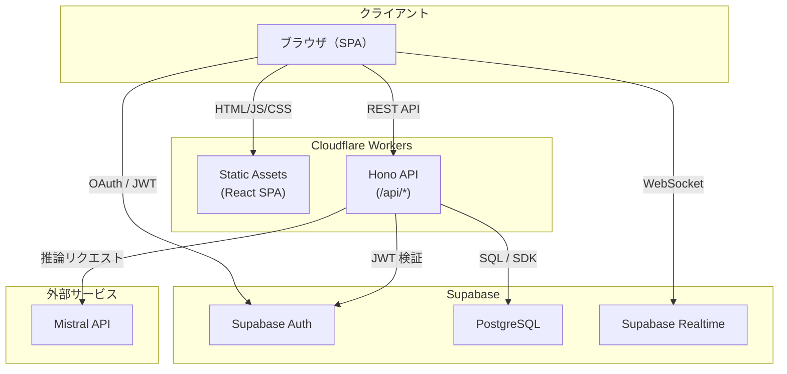
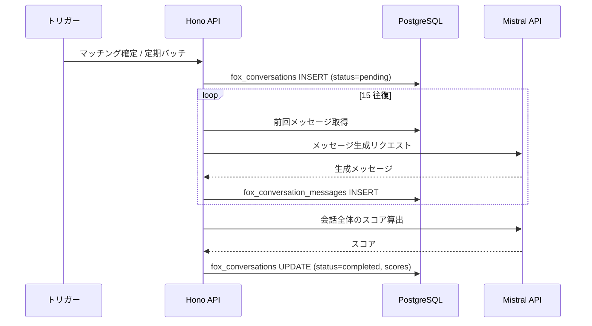
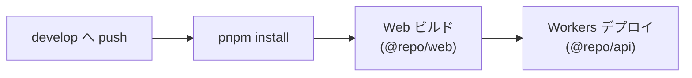

# 技術アーキテクチャ

## システム構成図



---

## モノレポ構成

pnpm Workspaces + Turborepo によるモノレポ構成。

```
foxx/
├── apps/
│   ├── api/          # バックエンド（Hono）
│   │   ├── src/
│   │   │   ├── index.ts        # Cloudflare Workers エントリーポイント
│   │   │   ├── node.ts         # Node.js 開発サーバー（ポート 3001）
│   │   │   ├── app.ts          # Hono アプリケーション定義
│   │   │   ├── env.ts          # 環境変数型定義
│   │   │   ├── types.ts        # 型エクスポート
│   │   │   └── db/
│   │   │       ├── client.ts   # Supabase クライアント生成
│   │   │       └── types.ts    # DB 型定義（Supabase CLI 生成）
│   │   ├── wrangler.toml       # Cloudflare Workers 設定
│   │   └── package.json
│   └── web/          # フロントエンド（React）
│       ├── src/
│       │   ├── main.tsx         # エントリーポイント
│       │   ├── api-client.ts    # API クライアント設定
│       │   ├── routes/          # TanStack Router ファイルベースルート
│       │   └── components/      # 共通コンポーネント
│       ├── vite.config.ts       # Vite 設定（プロキシ含む）
│       └── package.json
├── docs/
│   └── requirements/   # 要件定義ドキュメント
├── turbo.json           # Turborepo タスク設定
├── pnpm-workspace.yaml  # ワークスペース設定
├── .mise.toml           # ランタイムバージョン管理（Node.js 22, pnpm 10.13.1）
└── package.json         # ルート package.json
```

| パッケージ | 役割 | 主要技術 |
| --- | --- | --- |
| `@repo/api` | REST API サーバー + SPA 配信 | Hono, Supabase SDK, Mistral SDK |
| `@repo/web` | SPA フロントエンド | React 19, TanStack Router, Tailwind CSS, shadcn/ui |

`@repo/web` は `@repo/api` の型定義（`AppType`）をインポートし、Hono RPC による型安全な API クライアントを構成する。

---

## バックエンドアーキテクチャ

### ランタイム

| 環境 | ランタイム | エントリーポイント | 用途 |
| --- | --- | --- | --- |
| 本番 | Cloudflare Workers | `src/index.ts` | デプロイ先 |
| 開発 | Node.js（tsx watch） | `src/node.ts` | ローカル開発（ポート 3001） |

### フレームワーク: Hono

- 軽量な Web フレームワーク。Cloudflare Workers / Node.js 両方で動作
- `AppType` をエクスポートし、フロントエンドで Hono RPC クライアントとして利用
- ルーティングは `/api/*` 以下に集約

### ルーティング構造

```
/api
├── /auth           # 認証関連（Webhook）
├── /quiz           # クイズ
├── /speed-dating   # スピードデーティング
├── /profiles       # プロフィール
├── /matching       # マッチング
├── /fox-conversations    # フォックス代理会話（Step 1）
├── /partner-fox-chats    # パートナーフォックスチャット（Step 2）
├── /direct-chats         # ダイレクトチャット（Step 3）
├── /chat-requests        # チャットリクエスト
└── /moderation           # ブロック・通報
```

### 環境変数

| 変数名 | 説明 | 設定先 |
| --- | --- | --- |
| `SUPABASE_URL` | Supabase プロジェクト URL | wrangler secrets / .env |
| `SUPABASE_SERVICE_ROLE_KEY` | Supabase サービスロールキー | wrangler secrets / .env |
| `SUPABASE_ANON_KEY` | Supabase 匿名キー（JWT 検証用） | wrangler secrets / .env |
| `MISTRAL_API_KEY` | Mistral API キー | wrangler secrets / .env |

### 認証ミドルウェア

- クライアントから送信される `Authorization: Bearer <JWT>` ヘッダーを検証
- Supabase Auth が発行した JWT を `supabase.auth.getUser()` で検証し、`user_id` を取得
- 認証が必要なエンドポイントにミドルウェアとして適用

```
リクエスト → 認証ミドルウェア → ルートハンドラ → レスポンス
                ↓ (JWT 検証)
            Supabase Auth
```

---

## フロントエンドアーキテクチャ

### 技術スタック

| カテゴリ | 技術 | バージョン |
| --- | --- | --- |
| UI ライブラリ | React | 19.0.0 |
| ルーティング | TanStack Router | 1.121.2 |
| ビルドツール | Vite | 6.1.0 |
| スタイリング | Tailwind CSS | 4.0.6 |
| UI コンポーネント | shadcn/ui + Radix UI | - |
| テーマ | next-themes | 0.4.6 |
| テスト | Vitest + Testing Library | 3.0.5 |
| リンター/フォーマッター | Biome | 1.9.4 |

### ルーティング

TanStack Router のファイルベースルーティングを採用。Vite プラグイン（`TanStackRouterVite`）が `src/routes/` 配下のファイルからルートツリーを自動生成する。

- `autoCodeSplitting: true` によるルート単位のコード分割
- 除外パターン: `.stories.tsx`, `.model.ts`, `.test.ts`, `__tests__`

### API クライアント

Hono RPC を使用した型安全な API 通信。`@repo/api` が export する `AppType` を利用し、エンドポイントの型をフロントエンドで共有する。

### 開発時プロキシ

開発環境では Vite の `server.proxy` 設定により、`/api` へのリクエストをバックエンド（`http://localhost:3001`）にプロキシする。

---

## データベースアーキテクチャ

### Supabase PostgreSQL

- Supabase のマネージド PostgreSQL を使用
- DB 型定義は Supabase CLI (`supabase gen types typescript`) で自動生成し、`apps/api/src/db/types.ts` に配置

### 認証: Supabase Auth

- ユーザー認証は Supabase Auth に委譲
- `auth.users` テーブルは Supabase が管理
- アプリケーション固有のユーザー情報は `public.user_profiles` テーブルで管理し、`auth.users.id` を外部キーとして参照

### 認可: Row Level Security (RLS)

全テーブルで RLS を有効化し、ユーザーが自分のデータのみにアクセスできるようにする。

| ポリシーパターン | 適用条件 | 例 |
| --- | --- | --- |
| 自己参照 | `auth.uid() = user_id` | プロフィール、クイズ回答 |
| マッチ参加者 | `auth.uid() IN (user_a_id, user_b_id)` | マッチ、会話ログ |
| 挿入のみ | `auth.uid() = user_id` (INSERT) | 通報、ブロック |

### リアルタイム通信: Supabase Realtime

- ダイレクトチャット（Step 3）で Supabase Realtime を使用
- `direct_chat_messages` テーブルへの INSERT をリアルタイムにサブスクライブ
- クライアント側で Supabase SDK の `channel.on('postgres_changes', ...)` を使用

---

## AI 連携アーキテクチャ

### Mistral API

AI 推論には Mistral API を使用する。以下の機能で Mistral を呼び出す。

| 機能 | 用途 | 呼び出しタイミング |
| --- | --- | --- |
| F2-2 仮想ペルソナ生成 | クイズ回答から 3 タイプの仮想ペルソナを生成 | クイズ回答完了時 |
| F2-3 スピードデーティング | 仮想ペルソナとしてのチャット応答生成 | ユーザーメッセージ送信時（同期） |
| F2-4 プロフィール自動生成 | クイズ + 会話ログから構造化プロフィールを生成 | スピードデーティング完了時 |
| F4-2 代理会話 | フォックス同士の自動会話メッセージ生成 | バッチ処理（非同期） |
| F4-4 会話後スコア算出 | 代理会話ログから相性スコアを評価 | 代理会話完了時 |
| F6-2 パートナーフォックスチャット | 相手のフォックスとしてのチャット応答生成 | ユーザーメッセージ送信時（同期） |

### プロンプト管理

- 各機能のシステムプロンプトはコード内で定数として管理
- ユーザー固有のプロンプトはペルソナドキュメント（`personas.compiled_document`）として `personas` テーブルに保存
- ペルソナドキュメントは SKILL.md 形式の構造化 Markdown で、セクション単位（`persona_sections`）で管理される
- プロンプトの構成: `ペルソナドキュメント（DB）` + `コンテキスト（会話履歴等）` + `追加指示（定数）`

### 非同期処理

代理会話（F4）はバックグラウンドで実行される非同期処理。



Cloudflare Workers では `waitUntil()` を使い、レスポンス返却後にバックグラウンド処理を継続する。長時間の処理が必要な場合は Cloudflare Queues や Cron Triggers の利用を検討する。

---

## デプロイアーキテクチャ

### Cloudflare Workers

| 項目 | 値 |
| --- | --- |
| Workers 名 | `wingfox` |
| 互換性日付 | 2024-12-30 |
| 互換性フラグ | `nodejs_compat` |
| アセットディレクトリ | `../web/dist` |

- Hono API がリクエストを処理
- `/api/*` 以外のリクエストは Static Assets（React SPA）を配信
- SPA のクライアントサイドルーティングに対応

### CI/CD: GitHub Actions



| ステップ | コマンド |
| --- | --- |
| 依存関係インストール | `pnpm install --frozen-lockfile` |
| Web ビルド | `pnpm --filter @repo/web build` |
| Workers デプロイ | `pnpm --filter @repo/api run deploy` |

### 環境分離

| 環境 | ブランチ | デプロイ先 | 用途 |
| --- | --- | --- | --- |
| 開発 | `develop` | Cloudflare Workers (dev) | 開発・検証 |
| 本番 | `main` | Cloudflare Workers (prod) | 本番運用 |

環境ごとに異なる Supabase プロジェクトと Mistral API キーを使用する。Cloudflare Workers の Secrets で管理する。

---

## 開発環境

### 必須ツール

| ツール | バージョン | 用途 |
| --- | --- | --- |
| Node.js | 22 | ランタイム |
| pnpm | 10.13.1 | パッケージマネージャー |
| mise | - | ランタイムバージョン管理 |

### 開発サーバー

```bash
pnpm dev
```

| サービス | URL | 説明 |
| --- | --- | --- |
| Web（Vite） | http://localhost:3000 | フロントエンド開発サーバー |
| API（Node.js） | http://localhost:3001 | バックエンド開発サーバー |

Vite のプロキシ設定により、フロントエンドから `/api/*` へのリクエストは自動的にバックエンドに転送される。
