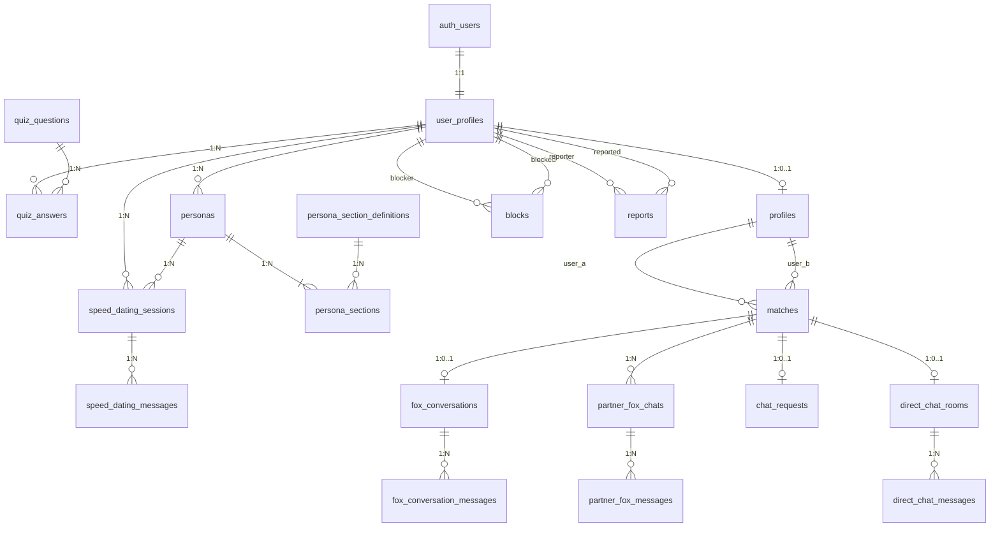

# データモデル

## ER 図



---

## テーブル定義

### 命名規約

- テーブル名: スネークケース、複数形（`user_profiles`, `quiz_answers`）
- カラム名: スネークケース（`created_at`, `user_id`）
- 主キー: `id`（UUID v4、デフォルト `gen_random_uuid()`）
- タイムスタンプ: 全テーブルに `created_at`、更新可能なテーブルに `updated_at`
- 外部キー: `{参照先テーブル単数形}_id`（例: `user_id`, `match_id`）

---

### user_profiles

ユーザーの基本情報。`auth.users` と 1:1 で対応する。

| カラム | 型 | 制約 | 説明 |
| --- | --- | --- | --- |
| id | uuid | PK, DEFAULT gen_random_uuid() | |
| auth_user_id | uuid | UNIQUE, NOT NULL, FK → auth.users(id) ON DELETE CASCADE | Supabase Auth ユーザー ID |
| nickname | text | NOT NULL | 表示名 |
| gender | text | CHECK (gender IN ('male', 'female', 'other', 'undisclosed')) | 性別 |
| avatar_url | text | | アバター画像 URL |
| onboarding_status | text | NOT NULL, DEFAULT 'not_started', CHECK (...) | オンボーディング進捗 |
| created_at | timestamptz | NOT NULL, DEFAULT now() | |
| updated_at | timestamptz | NOT NULL, DEFAULT now() | |

`onboarding_status` の値: `not_started` / `quiz_completed` / `speed_dating_completed` / `profile_generated` / `persona_generated` / `confirmed`

**インデックス:**
- `idx_user_profiles_auth_user_id` ON `auth_user_id` (UNIQUE)

---

### quiz_questions

クイズ質問のマスタデータ。

| カラム | 型 | 制約 | 説明 |
| --- | --- | --- | --- |
| id | text | PK | 質問 ID（例: `q1_weekend`） |
| category | text | NOT NULL | カテゴリ（性格, コミュニケーション, 趣味, 価値観, 恋愛観, ライフスタイル, 基本情報） |
| question_text | text | NOT NULL | 質問文 |
| options | jsonb | NOT NULL | 選択肢の配列 `[{"value": "explore", "label": "新しい場所を探索"}]` |
| allow_multiple | boolean | NOT NULL, DEFAULT false | 複数選択可否 |
| sort_order | integer | NOT NULL | 表示順 |
| created_at | timestamptz | NOT NULL, DEFAULT now() | |

**インデックス:**
- `idx_quiz_questions_sort_order` ON `sort_order`

---

### quiz_answers

ユーザーのクイズ回答。

| カラム | 型 | 制約 | 説明 |
| --- | --- | --- | --- |
| id | uuid | PK, DEFAULT gen_random_uuid() | |
| user_id | uuid | NOT NULL, FK → user_profiles(id) ON DELETE CASCADE | |
| question_id | text | NOT NULL, FK → quiz_questions(id) | |
| selected | jsonb | NOT NULL | 選択した値の配列 `["explore", "cooking"]` |
| created_at | timestamptz | NOT NULL, DEFAULT now() | |

**制約:**
- UNIQUE (user_id, question_id) — 同じ質問に対して 1 回答

**インデックス:**
- `idx_quiz_answers_user_id` ON `user_id`
- `idx_quiz_answers_question_id` ON `question_id`

---

### speed_dating_sessions

スピードデーティングのセッション。

| カラム | 型 | 制約 | 説明 |
| --- | --- | --- | --- |
| id | uuid | PK, DEFAULT gen_random_uuid() | |
| user_id | uuid | NOT NULL, FK → user_profiles(id) ON DELETE CASCADE | |
| persona_id | uuid | NOT NULL, FK → personas(id) ON DELETE CASCADE | 対話相手のペルソナ（`virtual_*` タイプ） |
| status | text | NOT NULL, DEFAULT 'active', CHECK (status IN ('active', 'completed')) | |
| message_count | integer | NOT NULL, DEFAULT 0 | メッセージ往復数 |
| started_at | timestamptz | NOT NULL, DEFAULT now() | |
| completed_at | timestamptz | | |
| created_at | timestamptz | NOT NULL, DEFAULT now() | |

**インデックス:**
- `idx_speed_dating_sessions_user_id` ON `user_id`
- `idx_speed_dating_sessions_persona_id` ON `persona_id`

---

### speed_dating_messages

スピードデーティング中の個別メッセージ。

| カラム | 型 | 制約 | 説明 |
| --- | --- | --- | --- |
| id | uuid | PK, DEFAULT gen_random_uuid() | |
| session_id | uuid | NOT NULL, FK → speed_dating_sessions(id) ON DELETE CASCADE | |
| role | text | NOT NULL, CHECK (role IN ('user', 'persona')) | 送信者 |
| content | text | NOT NULL | メッセージ本文 |
| created_at | timestamptz | NOT NULL, DEFAULT now() | |

**インデックス:**
- `idx_speed_dating_messages_session_id` ON `session_id`
- `idx_speed_dating_messages_session_created` ON `(session_id, created_at)`

---

### profiles

クイズ回答 + スピードデーティングから自動生成された構造化プロフィール。

| カラム | 型 | 制約 | 説明 |
| --- | --- | --- | --- |
| id | uuid | PK, DEFAULT gen_random_uuid() | |
| user_id | uuid | UNIQUE, NOT NULL, FK → user_profiles(id) ON DELETE CASCADE | |
| basic_info | jsonb | NOT NULL, DEFAULT '{}' | 基本情報（年齢層、地域、職業） |
| personality_tags | jsonb | NOT NULL, DEFAULT '[]' | 性格タグ配列 |
| personality_analysis | jsonb | NOT NULL, DEFAULT '{}' | 性格分析スコア（introvert_extrovert 等） |
| interests | jsonb | NOT NULL, DEFAULT '[]' | 趣味（カテゴリ+アイテム） |
| values | jsonb | NOT NULL, DEFAULT '{}' | 価値観スコア |
| romance_style | jsonb | NOT NULL, DEFAULT '{}' | 恋愛スタイル |
| communication_style | jsonb | NOT NULL, DEFAULT '{}' | コミュニケーションスタイル |
| lifestyle | jsonb | NOT NULL, DEFAULT '{}' | ライフスタイル |
| status | text | NOT NULL, DEFAULT 'draft', CHECK (status IN ('draft', 'confirmed')) | |
| version | integer | NOT NULL, DEFAULT 1 | やり直し時にインクリメント |
| confirmed_at | timestamptz | | 確定日時 |
| created_at | timestamptz | NOT NULL, DEFAULT now() | |
| updated_at | timestamptz | NOT NULL, DEFAULT now() | |

**インデックス:**
- `idx_profiles_user_id` ON `user_id` (UNIQUE)
- `idx_profiles_status` ON `status` WHERE status = 'confirmed'（確定済みプロフィールの検索用）

---

### persona_section_definitions

ペルソナドキュメントのセクション定義マスタ。ペルソナドキュメント（SKILL.md 形式）を構成するセクションの種類を定義する。ウィングフォックス・仮想ペルソナの両方で共通して使用する。

| カラム | 型 | 制約 | 説明 |
| --- | --- | --- | --- |
| id | text | PK | セクションキー（例: `core_identity`） |
| title | text | NOT NULL | 表示用タイトル（例: 「コアアイデンティティ」） |
| description | text | NOT NULL | セクションの説明 |
| generation_prompt | text | NOT NULL | Mistral にこのセクションを生成させる際のプロンプト |
| sort_order | integer | NOT NULL | ドキュメント内の表示順 |
| editable | boolean | NOT NULL, DEFAULT true | ユーザーが編集可能か |
| applicable_persona_types | text[] | NOT NULL, DEFAULT ARRAY['wingfox','virtual_similar','virtual_complementary','virtual_discovery'] | 適用対象のペルソナ種別 |
| created_at | timestamptz | NOT NULL, DEFAULT now() | |

**初期データ:**

| id | title | sort_order | editable | 適用対象 |
| --- | --- | --- | --- | --- |
| `core_identity` | コアアイデンティティ | 1 | true | 全種別 |
| `communication_rules` | コミュニケーションルール | 2 | true | 全種別 |
| `personality_profile` | パーソナリティプロファイル | 3 | true | 全種別 |
| `interests` | 興味・関心マップ | 4 | true | 全種別 |
| `values` | 価値観 | 5 | true | 全種別 |
| `romance_style` | 恋愛スタイル | 6 | true | `wingfox` のみ |
| `conversation_references` | 会話リファレンス | 7 | false | `wingfox` のみ |
| `constraints` | 制約事項 | 8 | false | 全種別 |

**インデックス:**
- `idx_persona_section_definitions_sort_order` ON `sort_order`

---

### personas

ペルソナドキュメント本体。ウィングフォックスと仮想ペルソナの両方を統一的に管理する。`persona_type` で種別を区別する。

| カラム | 型 | 制約 | 説明 |
| --- | --- | --- | --- |
| id | uuid | PK, DEFAULT gen_random_uuid() | |
| user_id | uuid | NOT NULL, FK → user_profiles(id) ON DELETE CASCADE | 所有ユーザー |
| persona_type | text | NOT NULL, CHECK (persona_type IN ('wingfox', 'virtual_similar', 'virtual_complementary', 'virtual_discovery')) | ペルソナ種別 |
| name | text | NOT NULL | ペルソナ名（例: 「ゆうきのウィングフォックス」「さくら」） |
| compiled_document | text | NOT NULL | セクションから合成された完全な Markdown ドキュメント |
| version | integer | NOT NULL, DEFAULT 1 | やり直し時にインクリメント |
| created_at | timestamptz | NOT NULL, DEFAULT now() | |
| updated_at | timestamptz | NOT NULL, DEFAULT now() | |

**制約:**
- UNIQUE (user_id, persona_type) — 1 ユーザーにつきペルソナ種別ごとに 1 レコード

**インデックス:**
- `idx_personas_user_id` ON `user_id`
- `idx_personas_user_type` ON `(user_id, persona_type)` (UNIQUE)
- `idx_personas_wingfox` ON `user_id` WHERE `persona_type = 'wingfox'`（ウィングフォックス取得の高速化）

---

### persona_sections

ペルソナドキュメントの個別セクション。セクション単位で保存することで、ユーザーがセクションごとに確認・編集できる。ウィングフォックス・仮想ペルソナの両方で共通のテーブルを使用する。

| カラム | 型 | 制約 | 説明 |
| --- | --- | --- | --- |
| id | uuid | PK, DEFAULT gen_random_uuid() | |
| persona_id | uuid | NOT NULL, FK → personas(id) ON DELETE CASCADE | |
| section_id | text | NOT NULL, FK → persona_section_definitions(id) | セクション種別 |
| content | text | NOT NULL | セクションの内容（Markdown） |
| source | text | NOT NULL, DEFAULT 'auto', CHECK (source IN ('auto', 'manual')) | `auto`=自動生成 / `manual`=ユーザー編集 |
| created_at | timestamptz | NOT NULL, DEFAULT now() | |
| updated_at | timestamptz | NOT NULL, DEFAULT now() | |

**制約:**
- UNIQUE (persona_id, section_id) — 1 ペルソナにつきセクション種別ごとに 1 レコード

**インデックス:**
- `idx_persona_sections_persona_id` ON `persona_id`
- `idx_persona_sections_section_id` ON `section_id`

---

### matches

マッチングペアとスコア。

| カラム | 型 | 制約 | 説明 |
| --- | --- | --- | --- |
| id | uuid | PK, DEFAULT gen_random_uuid() | |
| user_a_id | uuid | NOT NULL, FK → user_profiles(id) ON DELETE CASCADE | ユーザー A |
| user_b_id | uuid | NOT NULL, FK → user_profiles(id) ON DELETE CASCADE | ユーザー B |
| profile_score | numeric(5,2) | | プロフィールベーススコア（0〜100） |
| conversation_score | numeric(5,2) | | 会話ベーススコア（0〜100） |
| final_score | numeric(5,2) | | 最終スコア（profile × 0.4 + conversation × 0.6） |
| score_details | jsonb | DEFAULT '{}' | スコア内訳（性格, 趣味, 価値観 等） |
| status | text | NOT NULL, DEFAULT 'pending', CHECK (status IN ('pending', 'fox_conversation_in_progress', 'fox_conversation_completed', 'partner_chat_started', 'direct_chat_requested', 'direct_chat_active')) | マッチングステータス |
| created_at | timestamptz | NOT NULL, DEFAULT now() | |
| updated_at | timestamptz | NOT NULL, DEFAULT now() | |

**制約:**
- UNIQUE (user_a_id, user_b_id) — 同じペアの重複防止
- CHECK (user_a_id < user_b_id) — ペアの一意性を保証（A < B の順で格納）

**インデックス:**
- `idx_matches_user_a_id` ON `user_a_id`
- `idx_matches_user_b_id` ON `user_b_id`
- `idx_matches_final_score` ON `final_score DESC NULLS LAST`
- `idx_matches_scored` ON `(final_score DESC NULLS LAST)` WHERE `final_score IS NOT NULL`（スコア確定済みマッチの検索用）

---

### fox_conversations

フォックス同士の代理会話セッション（Step 1）。

| カラム | 型 | 制約 | 説明 |
| --- | --- | --- | --- |
| id | uuid | PK, DEFAULT gen_random_uuid() | |
| match_id | uuid | UNIQUE, NOT NULL, FK → matches(id) ON DELETE CASCADE | 対応するマッチ |
| status | text | NOT NULL, DEFAULT 'pending', CHECK (status IN ('pending', 'in_progress', 'completed', 'failed')) | |
| total_rounds | integer | NOT NULL, DEFAULT 15 | 目標往復数 |
| current_round | integer | NOT NULL, DEFAULT 0 | 現在の往復数 |
| conversation_analysis | jsonb | DEFAULT '{}' | 会話分析結果（盛り上がり、共通点、相互関心度） |
| started_at | timestamptz | | |
| completed_at | timestamptz | | |
| created_at | timestamptz | NOT NULL, DEFAULT now() | |

**インデックス:**
- `idx_fox_conversations_match_id` ON `match_id` (UNIQUE)
- `idx_fox_conversations_status` ON `status` WHERE status IN ('pending', 'in_progress')

---

### fox_conversation_messages

フォックス代理会話のメッセージ（Step 1）。

| カラム | 型 | 制約 | 説明 |
| --- | --- | --- | --- |
| id | uuid | PK, DEFAULT gen_random_uuid() | |
| conversation_id | uuid | NOT NULL, FK → fox_conversations(id) ON DELETE CASCADE | |
| speaker_user_id | uuid | NOT NULL, FK → user_profiles(id) | どちらのフォックスが発言したか |
| content | text | NOT NULL | メッセージ本文 |
| round_number | integer | NOT NULL | 何往復目か |
| created_at | timestamptz | NOT NULL, DEFAULT now() | |

**インデックス:**
- `idx_fox_conv_messages_conversation_id` ON `conversation_id`
- `idx_fox_conv_messages_conv_round` ON `(conversation_id, round_number)`
- `idx_fox_conv_messages_speaker_user_id` ON `speaker_user_id`

---

### partner_fox_chats

パートナーフォックスチャットセッション（Step 2）。

| カラム | 型 | 制約 | 説明 |
| --- | --- | --- | --- |
| id | uuid | PK, DEFAULT gen_random_uuid() | |
| match_id | uuid | NOT NULL, FK → matches(id) ON DELETE CASCADE | 対応するマッチ |
| user_id | uuid | NOT NULL, FK → user_profiles(id) ON DELETE CASCADE | チャットを開始したユーザー |
| partner_user_id | uuid | NOT NULL, FK → user_profiles(id) | フォックスの持ち主（相手） |
| created_at | timestamptz | NOT NULL, DEFAULT now() | |

**制約:**
- UNIQUE (match_id, user_id) — 1 マッチにつきユーザーごとに 1 チャット

**インデックス:**
- `idx_partner_fox_chats_match_id` ON `match_id`
- `idx_partner_fox_chats_user_id` ON `user_id`
- `idx_partner_fox_chats_partner_user_id` ON `partner_user_id`

---

### partner_fox_messages

パートナーフォックスチャットのメッセージ（Step 2）。

| カラム | 型 | 制約 | 説明 |
| --- | --- | --- | --- |
| id | uuid | PK, DEFAULT gen_random_uuid() | |
| chat_id | uuid | NOT NULL, FK → partner_fox_chats(id) ON DELETE CASCADE | |
| role | text | NOT NULL, CHECK (role IN ('user', 'fox')) | 送信者（ユーザー or 相手のフォックス） |
| content | text | NOT NULL | メッセージ本文 |
| created_at | timestamptz | NOT NULL, DEFAULT now() | |

**インデックス:**
- `idx_partner_fox_messages_chat_id` ON `chat_id`
- `idx_partner_fox_messages_chat_created` ON `(chat_id, created_at)`

---

### chat_requests

ダイレクトチャットリクエスト。

| カラム | 型 | 制約 | 説明 |
| --- | --- | --- | --- |
| id | uuid | PK, DEFAULT gen_random_uuid() | |
| match_id | uuid | NOT NULL, FK → matches(id) ON DELETE CASCADE | 対応するマッチ |
| requester_id | uuid | NOT NULL, FK → user_profiles(id) | リクエスト送信者 |
| responder_id | uuid | NOT NULL, FK → user_profiles(id) | リクエスト受信者 |
| status | text | NOT NULL, DEFAULT 'pending', CHECK (status IN ('pending', 'accepted', 'declined', 'expired')) | |
| responded_at | timestamptz | | 応答日時 |
| expires_at | timestamptz | NOT NULL | 有効期限（作成から 48 時間後） |
| created_at | timestamptz | NOT NULL, DEFAULT now() | |

**制約:**
- UNIQUE (match_id) — 1 マッチにつき 1 リクエスト

**インデックス:**
- `idx_chat_requests_match_id` ON `match_id` (UNIQUE)
- `idx_chat_requests_requester_id` ON `requester_id`
- `idx_chat_requests_responder_id` ON `responder_id` WHERE status = 'pending'
- `idx_chat_requests_expires_at` ON `expires_at` WHERE status = 'pending'（有効期限切れバッチ処理用）

---

### direct_chat_rooms

ダイレクトチャットルーム（Step 3）。

| カラム | 型 | 制約 | 説明 |
| --- | --- | --- | --- |
| id | uuid | PK, DEFAULT gen_random_uuid() | |
| match_id | uuid | UNIQUE, NOT NULL, FK → matches(id) ON DELETE CASCADE | 対応するマッチ |
| status | text | NOT NULL, DEFAULT 'active', CHECK (status IN ('active', 'closed')) | |
| created_at | timestamptz | NOT NULL, DEFAULT now() | |

**インデックス:**
- `idx_direct_chat_rooms_match_id` ON `match_id` (UNIQUE)

---

### direct_chat_messages

ダイレクトチャットのメッセージ（Step 3）。Supabase Realtime でサブスクライブされる。

| カラム | 型 | 制約 | 説明 |
| --- | --- | --- | --- |
| id | uuid | PK, DEFAULT gen_random_uuid() | |
| room_id | uuid | NOT NULL, FK → direct_chat_rooms(id) ON DELETE CASCADE | |
| sender_id | uuid | NOT NULL, FK → user_profiles(id) | 送信者 |
| content | text | NOT NULL, CHECK (char_length(content) <= 1000) | メッセージ本文（最大 1,000 文字） |
| is_read | boolean | NOT NULL, DEFAULT false | 既読フラグ |
| created_at | timestamptz | NOT NULL, DEFAULT now() | |

**インデックス:**
- `idx_direct_chat_messages_room_id` ON `room_id`
- `idx_direct_chat_messages_sender_id` ON `sender_id`
- `idx_direct_chat_messages_room_created` ON `(room_id, created_at DESC)` — メッセージの時系列取得用
- `idx_direct_chat_messages_unread` ON `(room_id, sender_id)` WHERE is_read = false — 未読件数取得用

---

### blocks

ユーザーブロック。

| カラム | 型 | 制約 | 説明 |
| --- | --- | --- | --- |
| id | uuid | PK, DEFAULT gen_random_uuid() | |
| blocker_id | uuid | NOT NULL, FK → user_profiles(id) ON DELETE CASCADE | ブロックした側 |
| blocked_id | uuid | NOT NULL, FK → user_profiles(id) ON DELETE CASCADE | ブロックされた側 |
| created_at | timestamptz | NOT NULL, DEFAULT now() | |

**制約:**
- UNIQUE (blocker_id, blocked_id)
- CHECK (blocker_id != blocked_id)

**インデックス:**
- `idx_blocks_blocker_id` ON `blocker_id`
- `idx_blocks_blocked_id` ON `blocked_id`

---

### reports

通報。

| カラム | 型 | 制約 | 説明 |
| --- | --- | --- | --- |
| id | uuid | PK, DEFAULT gen_random_uuid() | |
| reporter_id | uuid | NOT NULL, FK → user_profiles(id) ON DELETE CASCADE | 通報者 |
| reported_id | uuid | NOT NULL, FK → user_profiles(id) ON DELETE CASCADE | 被通報者 |
| reason | text | NOT NULL, CHECK (reason IN ('harassment', 'inappropriate', 'spam', 'other')) | 通報理由 |
| description | text | | 詳細説明 |
| message_id | uuid | FK → direct_chat_messages(id) ON DELETE SET NULL | 対象メッセージ ID（任意） |
| status | text | NOT NULL, DEFAULT 'pending', CHECK (status IN ('pending', 'reviewed', 'resolved')) | 対応ステータス |
| created_at | timestamptz | NOT NULL, DEFAULT now() | |

**インデックス:**
- `idx_reports_reporter_id` ON `reporter_id`
- `idx_reports_reported_id` ON `reported_id`
- `idx_reports_status` ON `status` WHERE status = 'pending'
- `idx_reports_message_id` ON `message_id` WHERE message_id IS NOT NULL

---

## RLS ポリシー方針

全テーブルで RLS を有効化する。API からの操作は `service_role` キーではなくユーザーの JWT を使用してクエリを実行することを基本とするが、バッチ処理（代理会話生成、マッチング処理）では `service_role` を使用する。

### パフォーマンス原則

RLS ポリシーでは `auth.uid()` を必ず `(select auth.uid())` でラップする。これにより関数が行ごとに呼ばれず、クエリ実行中に一度だけ評価されてキャッシュされる（100x+ 高速化）。

```sql
-- NG: 行ごとに auth.uid() が呼ばれる
USING (auth.uid() = user_id)

-- OK: 一度だけ評価してキャッシュ
USING ((select auth.uid()) = user_id)
```

`user_profiles.auth_user_id` と `auth.uid()` の結合が頻繁に発生するため、以下のヘルパー関数を作成して再利用する。

```sql
CREATE OR REPLACE FUNCTION public.get_user_profile_id()
RETURNS uuid
LANGUAGE sql
STABLE
SECURITY DEFINER
SET search_path = ''
AS $$
  SELECT id FROM public.user_profiles WHERE auth_user_id = (select auth.uid())
$$;
```

### ポリシー一覧

| テーブル | 操作 | ポリシー（SQL） |
| --- | --- | --- |
| user_profiles | SELECT | `(select auth.uid()) = auth_user_id` |
| user_profiles | UPDATE | `(select auth.uid()) = auth_user_id` |
| quiz_questions | SELECT | 全ユーザーに許可（`TO authenticated`） |
| quiz_answers | SELECT, INSERT, UPDATE | `get_user_profile_id() = user_id` |
| speed_dating_sessions | SELECT, INSERT | `get_user_profile_id() = user_id` |
| speed_dating_messages | SELECT, INSERT | `get_user_profile_id() = (SELECT user_id FROM speed_dating_sessions WHERE id = session_id)` |
| profiles | SELECT, UPDATE | `get_user_profile_id() = user_id` |
| persona_section_definitions | SELECT | 全ユーザーに許可（`TO authenticated`） |
| personas | SELECT | `get_user_profile_id() = user_id` |
| persona_sections | SELECT | `get_user_profile_id() = (SELECT user_id FROM personas WHERE id = persona_id)` |
| persona_sections | UPDATE | 上記に加え `(SELECT editable FROM persona_section_definitions WHERE id = section_id) = true` |
| matches | SELECT | `get_user_profile_id() IN (user_a_id, user_b_id)` |
| fox_conversations | SELECT | `get_user_profile_id() IN (SELECT user_a_id, user_b_id FROM matches WHERE id = match_id)` |
| fox_conversation_messages | SELECT | `get_user_profile_id() IN (SELECT user_a_id, user_b_id FROM matches WHERE id = (SELECT match_id FROM fox_conversations WHERE id = conversation_id))` |
| partner_fox_chats | SELECT, INSERT | `get_user_profile_id() = user_id` |
| partner_fox_messages | SELECT, INSERT | `get_user_profile_id() = (SELECT user_id FROM partner_fox_chats WHERE id = chat_id)` |
| chat_requests | SELECT | `get_user_profile_id() IN (requester_id, responder_id)` |
| chat_requests | INSERT | `get_user_profile_id() = requester_id` |
| chat_requests | UPDATE | `get_user_profile_id() = responder_id`（承認/拒否は受信者のみ） |
| direct_chat_rooms | SELECT | `get_user_profile_id() IN (SELECT user_a_id, user_b_id FROM matches WHERE id = match_id)` |
| direct_chat_messages | SELECT, INSERT | `get_user_profile_id() IN (SELECT user_a_id, user_b_id FROM matches WHERE id = (SELECT match_id FROM direct_chat_rooms WHERE id = room_id))` |
| blocks | SELECT, INSERT | `get_user_profile_id() = blocker_id` |
| reports | INSERT | `get_user_profile_id() = reporter_id` |

---

## Supabase Realtime 設定

以下のテーブルで Supabase Realtime のパブリケーションを有効化する。

| テーブル | イベント | 用途 |
| --- | --- | --- |
| direct_chat_messages | INSERT | ダイレクトチャットの新着メッセージ配信 |
| chat_requests | INSERT, UPDATE | チャットリクエストの通知 |
| matches | UPDATE | マッチングステータスの更新通知 |
| fox_conversations | UPDATE | 代理会話の完了通知 |
