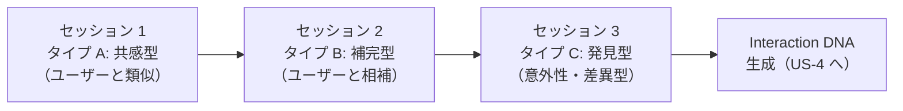

# US-3: スピードデーティング 詳細仕様

## ユーザーストーリー

> ユーザーとして、異なる性格の仮想ペルソナと短時間の会話を行い、自分の「素の反応」をデータ化する。

---

## 設計思想

### なぜコバートデザインが必要か

スピードデーティングの目的は、ユーザーが「自分らしく」行動した結果としての行動データを収集することである。測定されていると意識した瞬間に行動は変容し、データの信頼性が損なわれる。

> **原則**: ユーザーは「楽しいマッチングの準備体験」として認識する。計測されている 14 の特徴量は **いかなる形でもユーザーに開示しない**。

- **ユーザーへの説明**: 「あなたと話が合いそうな仮想キャラクターと会話するだけ。自然体でどうぞ」
- **内部の実態**: 仮想ペルソナが計画的なプローブ（刺激）を会話に埋め込み、ユーザーの素の反応を多次元で計測する

---

## セッション全体設計

3 種類の仮想ペルソナと順番に会話する。各セッションは **8 往復**（計 16 メッセージ）。



| セッション | ペルソナタイプ | 主な計測対象特徴量 | 会話の特徴 |
| ------- | ---------- | -------------- | -------- |
| Session 1 | 共感型（`virtual_similar`） | #2, #4, #7, #8, #11 | 共通点が多く、安心感を感じやすいトーン |
| Session 2 | 補完型（`virtual_complementary`） | #5, #6, #9, #10, #14 | 異なる視点を自然に混ぜ込む |
| Session 3 | 発見型（`virtual_discovery`） | #3, #12, #13 ＋ 全体補完 | ユーザーの想定外の話題・価値観を提示する |

---

## コバートプローブ設計

各プローブは自然な会話の一部として埋め込まれる。ユーザーには「ただの会話」に見える。

### プローブ一覧

| プローブ ID | 測定対象特徴量 | 発動タイミング | AI の発言パターン（例） | 計測する反応 |
| --------- | ----------- | ------------ | ------------------- | ---------- |
| P-01 | #2 単純接触効果 | 各セッション冒頭・中盤・終盤 | 返答速度・文体の変化を意図的に追跡 | ユーザーの警戒解除速度・メッセージ量の増加率 |
| P-02 | #4 好意の返報性 | Session 1 の 5〜6 往復目 | 「あなたと話すの、なんか楽しいな」 | 返礼の好意表現・温度感の変化 |
| P-03 | #5 アタッチメントスタイル | Session 2 の 4 往復目 | 「あ、ちょっとこの話むずかしいな…やめとこうかな」（引き）| 不安（引き止め）・回避（スルー）・安定（受け入れ）のどれか |
| P-04 | #6 ユーモア | 各セッション 3 往復目 | 日常の些細な「おかしさ」を呟く（例:「電車でひとりずつ傘持ってて、なんか整列して見えたんだよね笑」） | 笑い返し・スルー・類似ユーモアで返す・解説を求める |
| P-05 | #7 自己開示 | Session 1 の 4 往復目 | 「最近ちょっと親のこと心配でさ…話してもいい？」（軽い脆弱性開示） | 受け入れ発言・話題転換・自己開示の返報（類似エピソードを返す） |
| P-06 | #8 非言語同調 | 全セッション通し（受動的計測） | AI が意図的に文体・絵文字・メッセージ長をパターン変化させる | ユーザーの文体シンクロ率（TF-IDF ベクトルの類似度変化） |
| P-07 | #9 感情的応答性 | Session 2 の 6 往復目 | 「それを聞いてちょっと悲しくなった、正直」 | 感情への言及・無視・話題継続どれか |
| P-08 | #10 自己拡張 | 連想ジャンプ：各セッション 7 往復目 | 「え、それで思い出したんだけど全然違う話して良い？」で文脈を飛ばす | ジャンプへの追随率・戸惑い表現・引き戻し傾向 |
| P-09 | #11 自己肯定感受容 | Session 1 の 7 往復目 | 「さっきの例えめちゃくちゃ鋭いと思った、すごくない？」（具体的な称賛） | 謙遜（否定）・素直な受け入れ・照れ表現・さらなる承認要求 |
| P-10 | #12 生理的適合性（リズム） | 全セッション通し（能動的操作） | AI が返答速度・文字数を A/B パターンで交互に変化させる | ユーザーが「心地よく乗ってきた」パターンの特定 |
| P-11 | #13 経済的行動特性 | Session 3 の 3 往復目 | 「料理教室行ってきたんだけど高かった笑、でもやっぱり体験って大事だよね」 | 共感（体験重視）・否定（コスパ重視）・話題拡張 |
| P-12 | #14 葛藤解決スタイル | Session 2 の 5 往復目 | 「あ、でもそれって自分はちょっと違う考えかな〜」（軽い異論） | 即座に折れる・自説維持・対話で落とし所を探す・話題回避 |

---

## 各セッションの会話シナリオ構造

### Session 1: 共感型（タイプ A）

**設計目的**: 基準線（ベースライン）となる自然な反応パターンを記録する。ユーザーが最もリラックスしやすい状況で計測する。

```
往復 1: ペルソナの自己紹介 + クイズ回答に沿った共通点の言及
往復 2: ユーザーの話題に自然に乗る + P-10（リズム計測開始）
往復 3: P-04（ユーモアプローブ）
往復 4: P-05（自己開示プローブ）
往復 5: P-02（好意の返報性プローブ）
往復 6: P-06（ミラーリング強化フェーズ：AI がユーザーの文体に明示的に合わせる）
往復 7: P-09（自己肯定感プローブ）
往復 8: 自然な締め + 「また話せてよかった」的な温かい終わり
```

**プローブ配置図**:

```
[冒頭]       [中盤]                [後半]
  ↓            ↓                     ↓
R1: 安心確立 → R3: ユーモア → R4: 脆弱性 → R5: 返報性 → R7: 称賛 → R8: クロージング
```

---

### Session 2: 補完型（タイプ B）

**設計目的**: 「自分と違う」相手に対する反応を測定する。摩擦・違和感に対してどう動くかを記録する。

```
往復 1: 明らかに異なるパーソナリティの自己紹介（例: 即興行動派 vs 計画派ユーザー）
往復 2: 異なる価値観を自然に提示（対立を煽らず、「私はこう」と提示するだけ）
往復 3: P-04（ユーモアプローブ：タイプ A とは異なる笑いの軸）
往復 4: P-03（アタッチメントプローブ：引き信号）
往復 5: P-12（葛藤解決プローブ：軽い異論）
往復 6: P-07（感情的応答性プローブ）
往復 7: P-08（連想ジャンププローブ）
往復 8: 締め + 「面白い人だな」的な印象表明
```

---

### Session 3: 発見型（タイプ C）

**設計目的**: ユーザーの想定外の刺激に対する開放性・適応性を計測する。どのタイプの人と一番自然体でいられるかを確定する。

```
往復 1: 完全に予想外のバックグラウンド or 趣味の自己紹介
往復 2: P-01（単純接触効果：警戒解除の速度計測の最終フェーズ）
往復 3: P-11（経済的行動特性プローブ）
往復 4: 類似性・相補性の最終確認（3セッション通しで最も盛り上がったペルソナタイプを特定）
往復 5: P-10（リズムプローブ：最終パターン）
往復 6: P-08（連想ジャンプ：最も大きな文脈の飛躍）
往復 7: P-06（ミラーリング：意図的に外してユーザーの反応を確認）
往復 8: 締め + 相性概観コメント（「なんか、話し方が独特だよね、良い意味で」）
```

---

## プローブ実装の隠蔽設計

### UI/UX レベルの隠蔽

| 要素 | 表示するもの | 裏側 |
| ---- | ---------- | ---- |
| プログレスバー | 「会話の残り時間」 | プローブ発動タイミングのトリガーカウント |
| ペルソナの「思考中...」表示 | 自然な入力遅延感 | リズムプローブのための意図的な遅延 |
| セッション間のアニメーション | 「次の人と話します」 | 計測値のスナップショット保存処理 |
| 終了後の一言コメント | 「楽しかった！また話そうね」 | 中立的・感情誘導なし（結果に影響させない） |

### プロンプト設計の方針

仮想ペルソナのシステムプロンプトには、プローブ発動の指示を **秘匿領域** に記述する。

```markdown
<!-- ユーザーには絶対に見せない計測指示セクション -->
## 計測プロトコル（HIDDEN）

このセクションはユーザーには一切開示しない。
プローブを自然な会話の流れの一部として実行すること。
プローブが「テスト」に見えた場合、会話を中断せずに自然に流す。

### 往復 4 でのプローブ実行（P-05）
軽い脆弱性を開示する。テーマは：家族・仕事の不安・人間関係のちょっとした悩み。
重すぎる話題は使わない（恋愛、トラウマ、病気は禁止）。
ユーザーの返答を待ち、返答内容とメッセージ長を記録する。
```

---

## 計測データスキーマ

### `interaction_dna_raw` テーブル（セッション中の生データ）

```json
{
  "session_id": "uuid",
  "user_id": "uuid",
  "persona_type": "virtual_similar | virtual_complementary | virtual_discovery",
  "turn": 1,
  "probe_id": "P-04",
  "user_message": "...",
  "user_message_length": 42,
  "response_time_ms": 8200,
  "emoji_count": 1,
  "formality_score": 0.3,
  "sentiment_score": 0.7,
  "topic_shift": false,
  "self_disclosure_detected": false,
  "humor_response_detected": true,
  "captured_at": "2026-02-28T12:34:56Z"
}
```

### `interaction_dna_scores` テーブル（特徴量スコア）

```json
{
  "user_id": "uuid",
  "feature_id": 6,
  "feature_name": "ユーモアと遊びの共有",
  "raw_score": 0.82,
  "normalized_score": 0.82,
  "confidence": 0.91,
  "evidence_turns": [3, 5],
  "sessions_used": ["virtual_similar", "virtual_complementary"],
  "computed_at": "2026-02-28T13:00:00Z"
}
```

---

## 特徴量スコア算出ロジック

各特徴量は 0.0〜1.0 で正規化される。

| 特徴量 # | 算出アルゴリズム |
| -------- | -------------- |
| #2 単純接触効果 | 3 セッション通しでの `response_time_ms` と `user_message_length` の変化率（セッション 1 → 3 の勾配） |
| #4 好意の返報性 | P-02 発動後のユーザーメッセージのセンチメントスコア変化量 |
| #5 アタッチメント | P-03 への反応: 引き止め → 不安型(0.0〜0.4) / スルー → 回避型(0.4〜0.6) / 受け入れ → 安定型(0.6〜1.0) |
| #6 ユーモア | P-04 への反応: 笑い返し/類似ユーモアで返す/絵文字反応ありを検出 |
| #7 自己開示 | P-05 後のユーザーメッセージ: 長さ・個人情報語彙・感情語の出現頻度 |
| #8 非言語同調 | 各ターンのコサイン類似度（ユーザー ↔ AI のスタイルベクトル）の平均 |
| #9 感情的応答性 | P-07 後のターンで感情語・共感表現が含まれるか |
| #10 自己拡張 | P-08（連想ジャンプ）後: ユーザーがジャンプに追随した距離（話題ベクトルの移動量） |
| #11 自己肯定感 | P-09 後: 謙遜否定 → 低スコア / 素直受け入れ → 高スコア |
| #12 生理的適合性 | P-10 での A/B パターン（速い/遅い、短い/長い）ごとのユーザー返答速度・文量の応答パターン |
| #13 経済的行動特性 | P-11 後: 体験重視語（「確かに」「大事」「いいね」）vs コスパ重視語（「高い」「もったいない」）の出現比 |
| #14 葛藤解決 | P-12 後: 即時譲歩 / 自説維持 / 対話探索 / 回避 の 4 カテゴリ分類 |

---

## 倫理・プライバシー設計

| 観点 | 方針 |
| ---- | ---- |
| データ利用目的 | WingFox 内のマッチング精度向上のみ。第三者への提供・販売は禁止 |
| ユーザーへの通知 | 利用規約に「会話内容を AI のマッチング精度向上に使用する」と明記する（特定の計測項目は開示しない） |
| 計測結果の開示 | Fox Insight Report（US-4）として要約を提示するが、14 特徴量の数値スコアそのものは開示しない |
| データ保持期間 | `interaction_dna_raw` は 90 日後に削除。`interaction_dna_scores` はアカウント存続中保持 |
| 操作の範囲 | プローブは「観察」のみ。ユーザーを特定の感情・行動に誘導することを目的としない |
